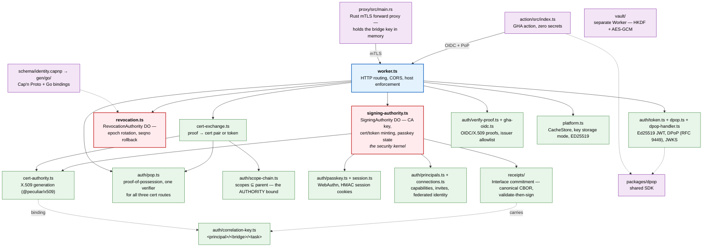
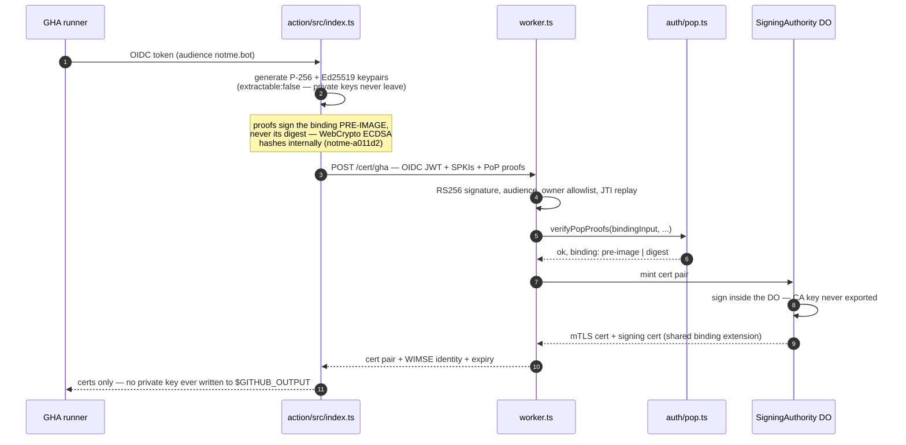
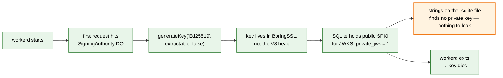
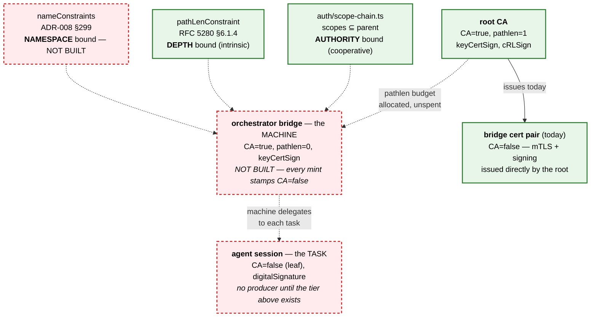
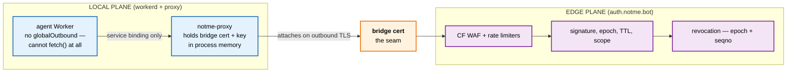

# Architecture

notme is an identity authority that gives AI agents their own cryptographic identity — scoped, ephemeral, revocable, distinct from the human who deployed them.

## Deployment targets

Same code runs in three environments:

```
Local dev    →  workerd serve config.capnp                      →  localhost:8788
Container    →  docker run ghcr.io/agentic-research/notme:0.1.0  →  localhost:8788
CF Workers   →  wrangler deploy                                  →  auth.notme.bot
```

Key storage differs by environment: ephemeral (in-memory only, local/CI), cf-managed (CF handles encryption, production). See `NOTME_KEY_STORAGE` in `docs/design/007-secretless-local-proxy.md`.

## Subsystems



The DOs are the security kernel: private keys are generated inside `SigningAuthority` and never leave it. Everything else is routing, validation, or encoding.

## Data flow

### GHA CI flow — OIDC to bridge cert



### Key lifecycle (ephemeral mode)



### Delegation chain — the target shape

`ADR-008` specifies three tiers. Only the outer two are built; the middle tier is unimplemented, which is why task-scoped revocation has no unit (`notme-600df1`, `notme-77a024`).



The three bounds are independent and none substitutes for another: scopes bound what a credential may **do**, pathlen bounds how far it may **pass that on**, nameConstraints bounds which identities it may **name**.

## Security model

**Two enforcement planes**, and the bridge cert is the contract between them — each validates independently, so neither has to trust the other:



Because the agent has no `globalOutbound` (ADR-009) and the proxy performs every outbound request, the proxy is a chokepoint the agent cannot route around — which is what lets it stamp an unforgeable correlation key, the way journald attaches `_SYSTEMD_UNIT` rather than trusting a process to report its own.

**Secretless invariants** (verified by adversarial tests):
1. No plaintext private key on disk
2. `crypto.subtle.exportKey()` on signing key throws
3. `NOTME_KEY_STORAGE=encrypted` without KEK = hard startup error
4. No private key material in any response or error message
5. JTI replay protection on all platforms
6. Constant-time comparison for security-sensitive strings

See `docs/design/007-secretless-local-proxy.md` for the full design spec.

## Platform abstraction

`src/platform.ts` provides a unified interface across runtimes:

| API | CF edge | Local workerd |
|-----|---------|---------------|
| `cache.get/put` | KV namespace | MemoryCache (Map + TTL) |
| `rateLimit` | CF rate limiter | Not available |
| `keyStorage` | `cf-managed` | `ephemeral` |
| Cache API | `caches.default` | Disabled (no backend) |

Detection is automatic via `NOTME_KEY_STORAGE` env var and `detectKeyStorage()`.

## Key files

| File | Lines | What |
|------|-------|------|
| `worker/worker.ts` | ~3350 | HTTP fetch handler (monolith — split planned via notme-9f51fa) |
| `worker/src/signing-authority.ts` | ~2110 | SigningAuthority DO — the security kernel |
| `proxy/src/main.rs` | ~1030 | mTLS forward proxy (TCP + UDS listen) |
| `packages/dpop/src/index.ts` | ~1100 | Shared JWT/crypto SDK |
| `worker/src/platform.ts` | ~210 | Platform abstraction + MemoryCache + ED25519 typing constant |
| `action/src/index.ts` | ~190 | GHA action |

## Testing

```bash
cd worker && npx vitest run    # 526 tests, 38 files (unit + adversarial + shared-SDK)
cd worker && npm run test:do   # 122 real-Durable-Object tests, 15 files (vitest-pool-workers)
bash test-local.sh             # workerd smoke test (endpoints + invariant #1)
bash test-e2e.sh               # Playwright e2e with virtual authenticator (contract tests)
cd ../proxy && cargo test      # Rust tests (listen-addr parser, UDS bind, perms, round-trip)
task worker:verify             # live endpoint checks against production or staging
```

Test categories (worker):
- **Adversarial**: key extraction, token forgery, confused deputy, DPoP injection, JTI replay, scope escalation, error-message leaks, mode downgrade
- **Real-DO** (vitest-pool-workers): boots real workerd + DO SQLite via `runInDurableObject` — rotation grace window, seqno rollback/isolation, `checkRevocation`, bootstrap, cert minting
- **Contract** (e2e): discovery shape, JWKS fields, CA cert PEM, error codes, passkey registration + authenticated access
- **Unit**: signing, token mint/verify, DPoP, sessions, connections, passkeys, routes, platform detection, canonical CBOR

Two conventions worth knowing before reading the suite:

- **`it.fails` marks a gap, not a bug.** `delegation-depth.do.test.ts` asserts the middle delegation tier is still missing, so it goes red the moment someone builds it — that is the signal to delete the `.fails`. A `todo` would sit inert and tell nobody. These show as "expected fail" in the DO run.
- **Some fixtures are deliberately foreign.** `pop-preimage.test.ts` and the hand-encoder in `receipt-commitment.test.ts` build inputs WITHOUT the code under test, because a fixture built by the encoder it validates is a fixed point rather than a conformance check. Both existing bugs of that shape — the double-hashed PoP and the float64 CBOR timestamp — survived review precisely because their tests were self-consistent.

Threat-model coverage is enumerated in `worker/THREAT_MODEL.md` — each row links to the test that defends it.
