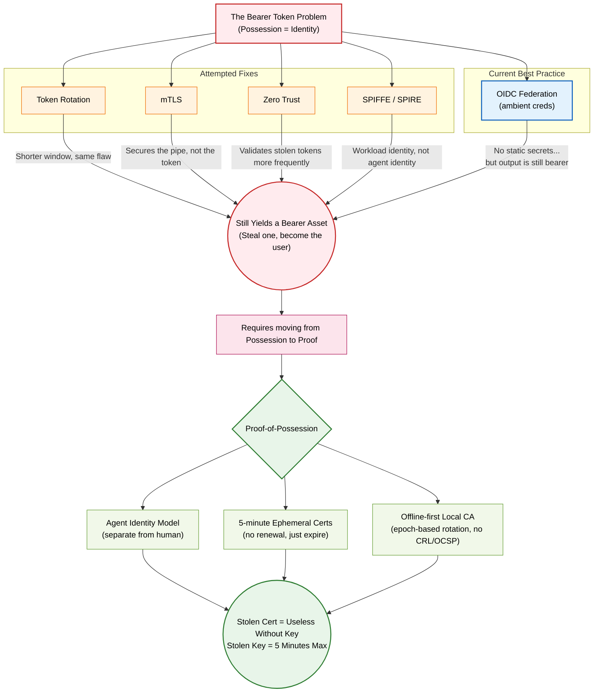
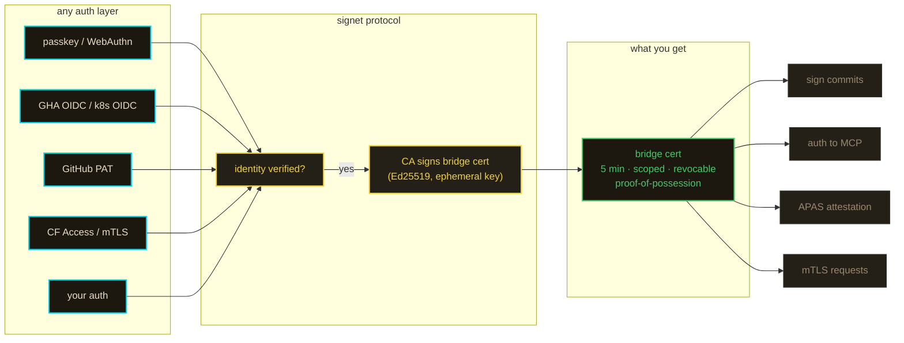

<!--
@doc-check
@types: CABundle, BridgeCertResult, CertScope
@endpoints: POST /cert, POST /cert/gha, GET /me, POST /invites, GET /.well-known/signet-authority.json, GET /.well-known/ca-bundle.pem, GET /api/docs
-->
# notme

> **⚠️ Experimental / Proof of Concept** — under active development. Not audited. See [SECURITY.md](SECURITY.md).

your agents are you. they shouldn't be.

every AI coding tool uses your credentials. your PAT, your SSH key, your OAuth token. when the agent is compromised, the attacker is you. there's no separation, no scope, no revocation.

notme is the identity layer that fixes this. agents get their own cryptographic identity — scoped, ephemeral, revocable, distinct from the human who deployed them.

## why



## how it works



signet doesn't care how you authenticated. it cares that you did. any auth layer feeds into the same protocol — the output is always a scoped, ephemeral, proof-of-possession cert.

`auth.notme.bot` is one implementation of this. run your own.

## what's here

```
schema/     cap'n proto type definitions (single source of truth across Go, TS, Rust)
gen/        auto-generated TS (Zod) + Go bindings from schema
worker/     cloudflare worker — the identity authority at auth.notme.bot
action/     reusable GHA action — OIDC token → bridge cert (zero secrets)
.github/    reusable GHA workflows (OIDC-authed, SHA-pinned)
```

## schema

shared types defined once in `.capnp`, generated for every language. `CABundle`, bridge cert results, OIDC claims, APAS predicates — all from one schema, all producing identical bytes when serialized.

this matters because signature verification depends on canonical encoding. if two implementations serialize the same struct differently, signatures break silently. cap'n proto's binary format is deterministic by design.

## worker

cloudflare worker deployed at [`auth.notme.bot`](https://auth.notme.bot). the `SigningAuthority` durable object generates the Ed25519 CA key on first request and stores it in SQLite. the key never leaves cloudflare infrastructure — no secrets to manage, no PEM files, no `wrangler secret put`.

**endpoints** (auth.notme.bot)

| method | path | what it does |
|--------|------|-------------|
| `POST` | `/cert` | any proof (passkey session, OIDC, bootstrap) → scoped bridge cert |
| `POST` | `/cert/gha` | GHA OIDC token → 5-min bridge cert (legacy compat) |
| `POST` | `/auth/passkey/register/*` | WebAuthn passkey registration |
| `POST` | `/auth/passkey/login/*` | WebAuthn passkey login |
| `GET` | `/me` | current session info |
| `POST` | `/invites` | create scoped invite token (requires authorityManage) |
| `GET/POST` | `/join` | redeem invite |
| `GET` | `/.well-known/signet-authority.json` | authority discovery |
| `GET` | `/.well-known/ca-bundle.pem` | X.509 CA certificate (trust anchor) |
| `GET` | `/api/docs` | full API reference |

## run your own

three ways — same code, same behavior.

**local (workerd)**
```bash
cd worker && npm run build:local
npx workerd serve config.capnp --experimental
# → http://localhost:8788
```

**container (melange + apko)**
```bash
cd packages
melange build melange-notme-app.yaml --arch aarch64 --signing-key melange.rsa --out-dir ./out --source-dir ../worker/
apko build apko-notme.yaml notme:latest notme.tar --keyring-append melange.rsa.pub --arch aarch64
docker load < notme.tar
docker run -p 8788:8788 notme:latest-arm64
```

**cloudflare workers**
```bash
cd worker
cp wrangler.toml.example wrangler.toml
# edit wrangler.toml — fill in your CF KV namespace ID
wrangler deploy
```

CA key is generated on first request. In ephemeral mode (local/container), the private key exists only in process memory — `cat *.sqlite | strings | grep '"d"'` returns nothing. First passkey registration requires a bootstrap code (visible in workerd stdout or `wrangler tail`).

## related

- [signet](https://github.com/agentic-research/signet) — Go identity server, APAS spec, bridge cert protocol
- [auth.notme.bot](https://auth.notme.bot) — live authority
- [notme.bot](https://notme.bot) — the standard
