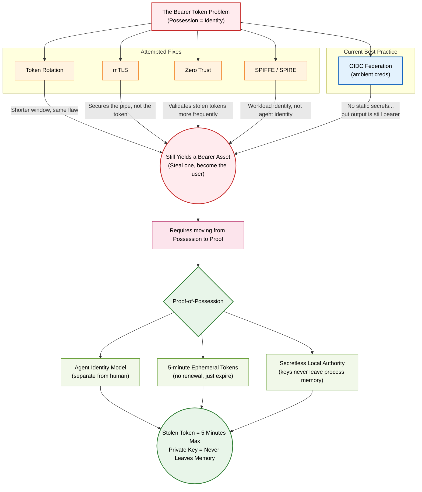
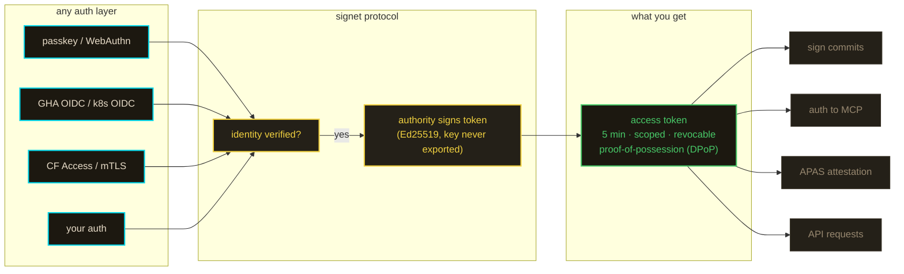

<!--
@doc-check
@types: CABundle, BridgeCertResult, CertScope
@endpoints: POST /cert, POST /cert/gha, POST /token, GET /authorize, GET /me, POST /invites, GET /.well-known/signet-authority.json, GET /.well-known/jwks.json, GET /.well-known/ca-bundle.pem, GET /api/docs
-->
# notme

> **experimental** — under active development. not audited. see [SECURITY.md](SECURITY.md).

your agents are you. they shouldn't be.

every AI coding tool uses your credentials. your PAT, your SSH key, your OAuth token. when the agent is compromised, the attacker is you. there's no separation, no scope, no revocation.

notme is the identity layer that fixes this. agents get their own cryptographic identity — scoped, ephemeral, revocable, distinct from the human who deployed them.

under the hood, notme is an identity **normalizer**. bring any auth you already passed — a passkey, a GitHub Actions OIDC token, a PAT, mTLS — and it re-issues that identity as a **standard** credential the rest of your stack already speaks: an X.509 bridge certificate (mTLS today; scoped for git signing and attestation) or a DPoP-bound OAuth access token ([RFC 9449](https://www.rfc-editor.org/rfc/rfc9449)) for HTTP and MCP. one Ed25519 authority signs both; the key never leaves process memory.

mechanically it's a bridge **certificate authority** *and* an OAuth **authorization server** over a single root — and deliberately **not** an OpenID provider. it never vends a third party a bearer claim about who you are; it converts auth you already proved into proof-of-possession you can't hand off by copying.

## why



## how it works



the authority doesn't care how you authenticated. it cares that you did. any auth layer feeds into the same protocol — the output is a scoped, ephemeral, proof-of-possession token. the signing key never leaves process memory.

## what's here

```
worker/             identity authority — auth.notme.bot (CF Worker + Durable Objects)
  src/                auth modules (passkey, DPoP, session, OIDC, principals)
  src/platform.ts     runtime abstraction (CF edge vs local workerd)
  e2e/                Playwright contract tests (virtual authenticator)
proxy/              Rust mTLS forward proxy — bridge cert lives in process memory,
                    workerd Workers fetch() through it. TCP or UDS listen.
action/             GHA action — OIDC → access token (zero secrets, zero files)
gen/ts/             shared SDK — base64url, validateClaims, computeJwkThumbprint
schema/             cap'n proto type definitions (CABundle, GHAClaims, etc.)
vault/              credential vault Worker (HKDF + AES-GCM envelope encryption)
packages/           container image pipeline (melange + apko, 40MB OCI)
docs/design/        design specs (007-secretless-local-proxy)
```

see [ARCHITECTURE.md](ARCHITECTURE.md) for the full subsystem map, data flow, and security model.

## endpoints (auth.notme.bot)

| method | path | what |
|--------|------|------|
| `POST` | `/cert/gha` | GHA OIDC → signed access token (secretless — no private key returned) |
| `POST` | `/cert` | any proof (passkey session, OIDC, bootstrap) → access token |
| `POST` | `/token` | DPoP-bound token issuance (RFC 9449) |
| `GET` | `/authorize` | OAuth-style redirect for cross-origin token issuance |
| `POST` | `/auth/passkey/register/*` | WebAuthn passkey registration |
| `POST` | `/auth/passkey/login/*` | WebAuthn passkey login |
| `GET` | `/me` | current session info (JSON or HTML) |
| `POST` | `/invites` | create scoped invite (requires authorityManage) |
| `GET/POST` | `/join` | redeem invite |
| `POST` | `/connect/*` | link federated identity (OIDC provider) |
| `GET` | `/.well-known/signet-authority.json` | authority discovery |
| `GET` | `/.well-known/jwks.json` | Ed25519 public key (JWK Set) |
| `GET` | `/.well-known/ca-bundle.pem` | X.509 CA certificate |

## run your own

three ways — same code, same behavior.

**local (workerd)**
```bash
cd worker && npm ci && npm run build:local
npx workerd serve config.capnp --experimental
# → http://localhost:8788
```

**container (melange + apko)**
```bash
task image              # bundles worker, signs apks, builds notme:0.1.0 OCI tar
docker load < packages/notme.tar
docker run -p 8788:8788 notme:0.1.0
curl localhost:8788/health    # → 200 ok
```

The `task image` target wraps the full pipeline (`worker:build-local`
→ melange apks → apko OCI tarball). Override the tag with
`task image TAG=mytag`. Cloister's `cluster.capnp` consumes
`notme:0.1.0`, so leave the default for cluster deployment. Requires
`apko`, `melange`, and a running Docker daemon.

**cloudflare workers**
```bash
cd worker
cp wrangler.toml.example wrangler.toml
# edit wrangler.toml — set your CF KV namespace ID
wrangler deploy
```

CA key is generated on first request. In ephemeral mode (local/container), the private key exists only in process memory — `cat *.sqlite | strings | grep '"d"'` returns nothing. First passkey registration requires a bootstrap code (visible in workerd stdout or `wrangler tail`).

## testing

```bash
cd worker
npx vitest run         # 329 tests (unit + adversarial)
npm run test:do        # 18 real-Durable-Object tests (vitest-pool-workers)
bash test-local.sh     # workerd smoke test
bash test-e2e.sh       # Playwright e2e (virtual authenticator)
cd ../proxy && cargo test  # Rust tests (parser, UDS bind, perms)
```

## repo layout

| Subdir | What | README |
|---|---|---|
| `worker/` | Cloudflare Worker — edge plane (TS). Same code runs at CF prod and local workerd. | [worker/README.md](worker/README.md) |
| `proxy/` | Local plane (Rust). Holds the bridge-cert private key in process memory. | [proxy/README.md](proxy/README.md) |
| `action/` | GitHub Action — `notme/action@<sha>`. CI-side identity exchange. | [action/README.md](action/README.md) |
| `schema/` | Cap'n Proto schemas — declared single source of truth for cross-language types. | [schema/README.md](schema/README.md) |
| `gen/` | Generated TS + Go from `schema/`. Don't edit manually. | [gen/README.md](gen/README.md) |
| `wasm/` | Empty slot for `leyline-sign` wasm32 artifact (gated on `ley-line-c764c6`). | [wasm/README.md](wasm/README.md) |
| `scripts/` | Standalone tooling (`doc-check.ts` etc.). | [scripts/README.md](scripts/README.md) |
| `packages/` | melange + apko — signed container bundles for self-hosted deployments. | [packages/README.md](packages/README.md) |
| `docs/design/` | ADRs 005-009. | [docs/README.md](docs/README.md) |
| `vault/` | Credential vault Worker — *moving to cloister; will become AGPL-3.0 there* | [vault/README.md](vault/README.md) |

## related

- [signet](https://github.com/agentic-research/signet) — Go identity server, APAS spec, bridge cert protocol
- [auth.notme.bot](https://auth.notme.bot) — live authority
- [notme.bot](https://notme.bot) — the standard
