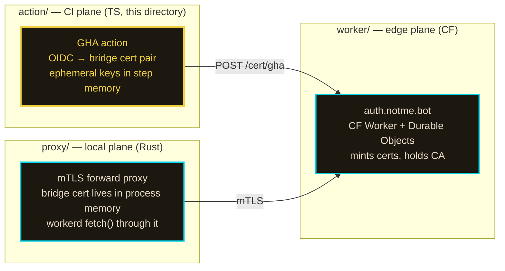
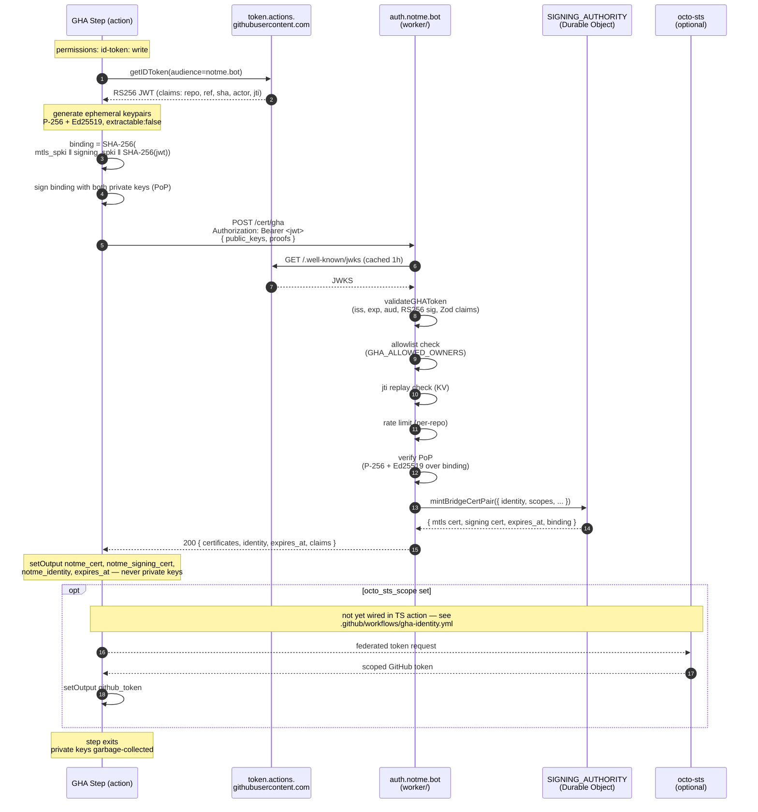

# action

GitHub Action — `agentic-research/notme/action@<sha>`. Exchanges a GHA OIDC token for a bridge cert pair (P-256 mTLS + Ed25519 signing) at `auth.notme.bot/cert/gha`.

zero secrets. private keys never leave the runner process memory; cert outputs are public data.

## what this is

the third runtime plane of notme:



distinct from the other two planes: this one runs *inside someone else's CI runner*. there's no persistent process, no secret store, no file to write a key to. the OIDC JWT is the only credential, and it's redeemed once per step.

## the exchange



binding payload includes `SHA-256(jwt)` so the PoP signatures are inseparable from the OIDC token they were minted against. swapping in a different JWT invalidates the binding.

## inputs

| input | default | purpose |
|---|---|---|
| `audience` | `notme.bot` | OIDC audience for the identity exchange — matches `GHA_CERT_AUDIENCE` on the worker |
| `authority_url` | `https://auth.notme.bot` | authority base URL — override for self-hosted CF or local workerd |
| `skip_bridge_cert` | `false` | skip identity exchange (octo-sts-only flows) |
| `octo_sts_scope` | `''` | octo-sts scope `org/repo` — empty skips. *not yet wired in TS action* |
| `octo_sts_identity` | `default` | octo-sts trust policy identity name |

`authority_url` is force-rejected if it starts with `http://` and isn't `localhost`/`127.0.0.1` — an http URL would transmit the OIDC JWT in plaintext.

## outputs

| output | purpose |
|---|---|
| `notme_url` | authority URL for subsequent API calls |
| `notme_cert` | P-256 bridge cert PEM — mTLS transport auth (public data) |
| `notme_signing_cert` | Ed25519 bridge cert PEM — git commit signing + APAS attestations (public data) |
| `notme_identity` | WIMSE identity URI: `wimse://notme.bot/gha/{owner}/{repo}` |
| `expires_at` | cert expiry (Unix timestamp). worker default TTL is 5 minutes |
| `github_token` | scoped GitHub token from octo-sts (empty if not requested) |

private keys are **never** an output. they exist only in the step's process memory and are garbage-collected when the step exits. for cross-step usage, run the action again — each invocation gets its own keypair.

## usage

```yaml
permissions:
  id-token: write       # required for getIDToken()
  contents: read

steps:
  - uses: actions/checkout@v4
  - uses: agentic-research/notme/action@<commit-sha>
    id: notme
    with:
      audience: notme.bot
  - run: |
      echo "identity: ${{ steps.notme.outputs.notme_identity }}"
      echo "expires:  ${{ steps.notme.outputs.expires_at }}"
```

self-hosted authority:

```yaml
  - uses: agentic-research/notme/action@<commit-sha>
    with:
      authority_url: https://auth.example.com
      audience: example.com
```

## pin by SHA

always pin by full commit SHA, never by tag:

```yaml
- uses: agentic-research/notme/action@a1b2c3d4...   # good
- uses: agentic-research/notme/action@v1            # bad — mutable
```

tags are mutable. an attacker who pushes to the action repo can move `v1` to a malicious commit and every consumer pinned by tag executes attacker code on the next CI run. the Trivy/Aqua incident (March 2026) was exactly this. SHA pinning makes the dependency content-addressed.

## entrypoints

| file | role |
|---|---|
| `action.yml` | manifest GitHub reads — declares 5 inputs, 6 outputs, `runs: node20`, `main: dist/index.js` |
| `src/index.ts` | source — keypair generation, PoP construction, exchange, output wiring |
| `dist/index.js` | committed bundle — what GitHub actually executes |

## build / release

```bash
cd action
npm install
npm run build      # esbuild src/index.ts → dist/index.js (bundled, node20)
git add dist/      # consumers run dist/, not src/
```

`dist/` is committed deliberately. GitHub Actions does not run `npm install` for action consumers — it just executes `main` from `action.yml`. shipping the bundle is the actions convention. dist drift is a real bug class: changes to `src/index.ts` without a matching dist rebuild are invisible to consumers.

## related

- [`../worker/worker.ts`](../worker/worker.ts) — `/cert/gha` route handler (`handleCertGHA`)
- [`../worker/src/gha-oidc.ts`](../worker/src/gha-oidc.ts) — RS256 JWT validator + Zod claims schema
- [`../worker/src/cert-exchange.ts`](../worker/src/cert-exchange.ts) — generalized cert exchange (passkey / OIDC / bootstrap)
- [`../docs/design/008-bridge-cert-csr-wimse.md`](../docs/design/008-bridge-cert-csr-wimse.md) — bridge cert format, WIMSE URI, PoP binding
- [`../README.md`](../README.md) — top-level repo overview, three runtime planes
- [`../schema/identity.capnp`](../schema/identity.capnp) — schema source of truth (TS bindings in `../gen/ts/`)
