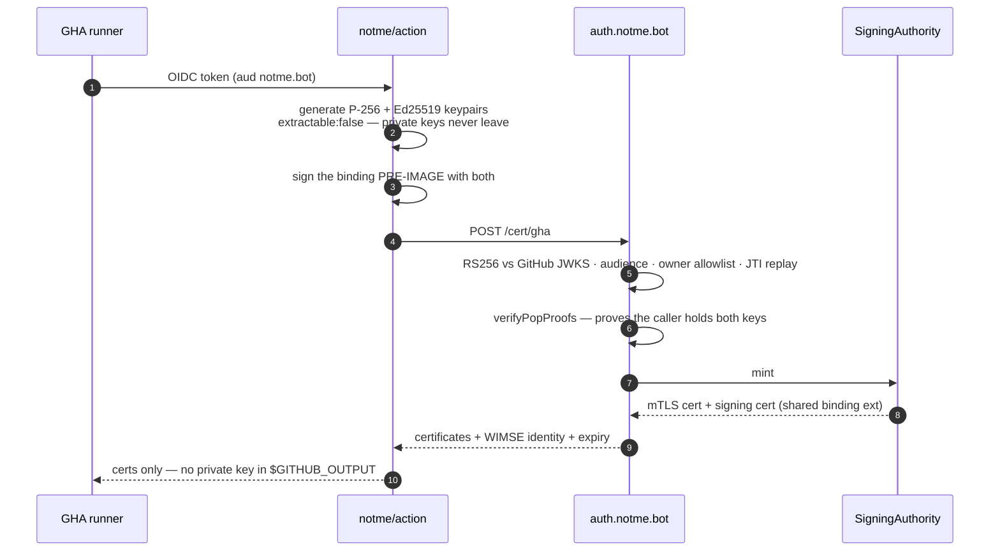
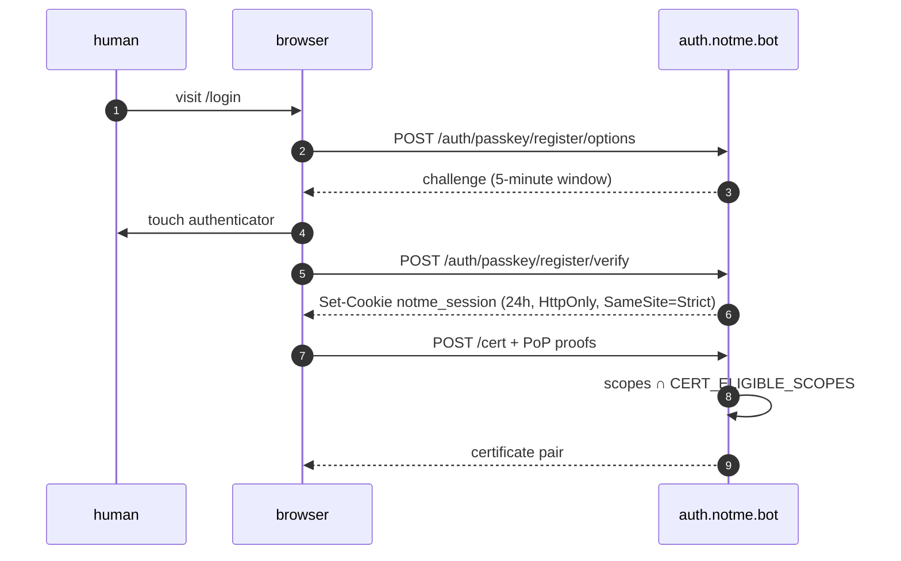
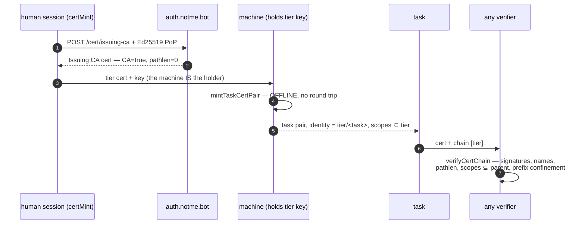
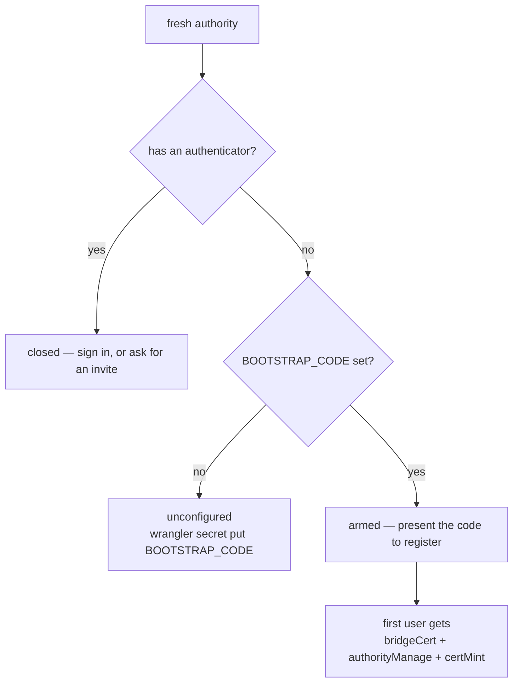
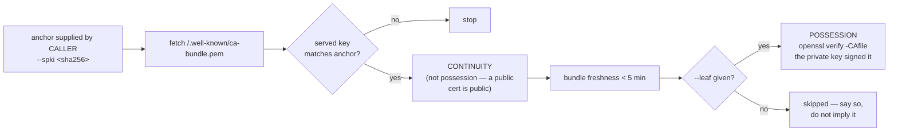
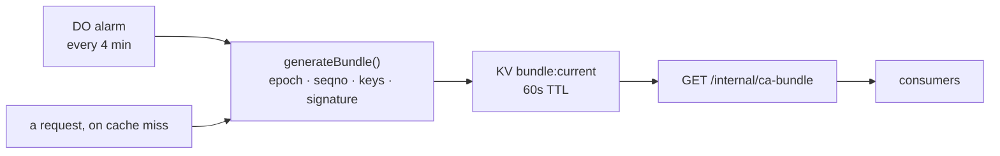

# Flows — the eight paths that matter

Quick reference. Every flow below is **live in production** unless marked
otherwise. For subsystem structure see [`../ARCHITECTURE.md`](../ARCHITECTURE.md);
for why things are the way they are, the ADRs in [`design/`](design/).

---

## 1. CI enrollment — a workflow gets an identity, no secrets

The one that carries the pitch: a GitHub Action obtains a short-lived
credential with **nothing stored anywhere**.



**Gotcha:** proofs sign the binding **pre-image**, never its digest.
`crypto.subtle` hashes internally, so signing a digest hashes twice and no Go
or Rust signer can interoperate (`notme-a011d2`). A migration window currently
accepts both and reports which — remove it once nothing reports `"digest"`.

---

## 2. Human enrollment — passkey to certificate



**Scopes narrow at the cert boundary.** A session holding `authorityManage`
mints a cert carrying only `bridgeCert` — a long-lived exportable credential
must not carry authority that was granted to a browser session.

**Known defect:** the identity reads `wimse://notme.bot/<authMethod>/<id>`, so
the same principal gets a *different* identity depending on how they signed in
(`notme-77438b`). ADR-019 exists to fix this.

---

## 2b. Delegation — human → machine → task



**The tier signs offline** — that is the point of issuing a CA tier rather
than a leaf. Every task cert carries its task scope (`task` + `goal_hash`,
`OID_TASK_SCOPE`) so it is bounded to *work*, not just to time, and
`taskCorrelationKey` recovers `<principal>/<bridge>/<task>` from the
certificates alone.

**Gotcha:** the task cert must name the **tier** as its issuer, not the root.
Names chain as well as keys (RFC 5280 §6.1.3); the walker checks both, and
the first chain-test fixtures were lying about it without anyone noticing.

**Gotcha, worse:** the root the authority SERVES must carry the budget the
code MINTS. Production served `pathlen:0` for five months after the code moved
to `pathlen=1`, because the DO's cache check asked only whether
BasicConstraints *existed* — so every Issuing CA tier minted in production was
unverifiable by any stock validator, while every test passed against a fresh
test root (`notme-1b1db4`). The DO now re-issues under the same key when the
served budget disagrees (no rotation, nothing in flight breaks), and
`worker:verify` reads the LIVE root's pathlen. Check yours:
`openssl x509 -in <(curl -s https://auth.notme.bot/.well-known/ca-bundle.pem) -noout -text | grep pathlen`.

---

## 3. First boot — how an authority gets its first admin



Asking about bootstrap state is a **read** — it mints nothing. Previously the
first unauthenticated request caused an admin code to be minted and logged, so
any stranger chose the moment a credential appeared (`notme-addef9`).

---

## 4. Admin recovery — when the last admin credential is lost

```
wrangler secret put BOOTSTRAP_CODE     # requires deployment control
# then register, presenting that code
```

The operator secret **outranks** the authenticator gate. Setting it requires
control of the deployment, which is strictly stronger than holding a passkey —
that operator could already redeploy, rebind KV, or replace the DO. Logged
loudly, because silent admin acquisition is what the gate guards.

Before this, losing the last `authorityManage` credential made the authority
permanently ungovernable (`notme-4838ae`).

**Prevention beats recovery:** hold more than one admin credential.
`POST /invites` with `{"scopes":["bridgeCert","authorityManage"]}`.

---

## 5. Provenance — prove who produced an artifact

```bash
./scripts/demo-provenance.sh          # --pause to step through it live
```

Four commands as an outsider: download a public artifact from another repo's
release, read the identity off its certificate, check the authority's key
against an anchor you pinned in advance, and verify the private key signed it.
No credential, no issuer software.

The credential in that chain **expired five minutes after it was issued** —
which is why `openssl verify` needs `-no_check_time`. Say that out loud before
anyone asks: the signature outlives the credential, and that is what makes
short-lived identity usable for provenance at all.

## 5b. Authority checks — continuity, freshness, possession

```bash
./scripts/check-authority.sh --spki <sha256> [--leaf agent-cert.pem]
```

The anchor is **required input**, never a default — a pin shipped inside the
repository being evaluated is not an anchor, it is a self-reference.

`curl`, `openssl`, `shasum`. No issuer software, because verification requiring
the issuer's code would be circular.



Pin on **SPKI**, not just the certificate — the *key* is the identity. A
re-issued cert over the same key is the same authority; a new key is not.

**Boundaries, stated.** Matching the served key against your anchor proves
CONTINUITY, not possession — a public certificate is public and anyone can
re-serve it. Only `--leaf` proves possession, by verifying a credential the
private key actually signed. The bundle *signature* is not checked at all:
Ed25519 over canonical CBOR needs a CBOR encoder, therefore software, therefore
a dependency on the issuer's ecosystem. This does **not** discharge Goal Zero
criterion (D).

---

## 6. Revocation — what actually works

| Lever | Granularity | Status |
|---|---|---|
| **Epoch rotation** | every cert issued under the old epoch | **works** — `verifyX509` compares `OID_EPOCH` |
| TTL expiry | one credential, ≤5 min | works |
| **Grant revocation** | one scope, one principal | **works** — `POST /principals/:id/revoke`; every authority gate reads the grant store LIVE, so it takes effect on the next request, not at cookie expiry |
| `checkRevocation` (bundle/seqno/kid) | external verifiers | SDK path; by design not called in-worker (in-worker checks read the live epoch) |

Rotation is the emergency lever; **the grant is the everyday one** (ADR-019
D3, criterion C). A passkey user is a principal with grants — `is_admin` no
longer decides anything after first enrollment — and revoking a grant strips
it from every live session immediately. Self-revocation of `authorityManage`
is refused (409): the last admin revoking themselves is `notme-4838ae` again.
Until 2026-08 `OID_EPOCH` was written into every cert and read nowhere, so
rotating bumped a number nothing compared.

**Never rotate production during a demo** — it invalidates every cert in
flight. Staging has its own CA and DOs for exactly this.

---

## 7. Bundle publication — how consumers learn about revocation



**Two independent refresh paths, and you need both.** The alarm never fired for
130 days *and* the KV write had no TTL, so the published bundle was four months
stale — rejected by any conformant verifier. Either safeguard alone would have
prevented it (`notme-77a024`, `notme-4896d8`).

Health: `GET /admin/alarm-health` (`authorityManage`-gated).

---

## 8. Deploy — promote, converge, then verify

```bash
task worker:deploy-preview                       # uploads, stamps BUILD_SHA
task worker:promote NEW=<version-id>
task worker:await-convergence                    # ← the load-bearing step
task worker:verify
```

**Convergence is not immediate.** After the API reports 100%, live traffic
alternates between old and new build for roughly a minute. `worker:verify`
retries for ~10 seconds — shorter than that window — so a verify run straight
after promotion can pass against the build being *replaced*.

Confirm with `curl -s https://auth.notme.bot/.well-known/version`.

**Rollback** is `task worker:promote NEW=<old-id>` — with the same convergence
caveat on the way back, which is exactly when nobody wants to wait.

**Version-override targeting does not work here** (`notme-9f2f79`): probing a
specific version returns the *old* one, measured 5/5. Verify after promoting,
not before.
