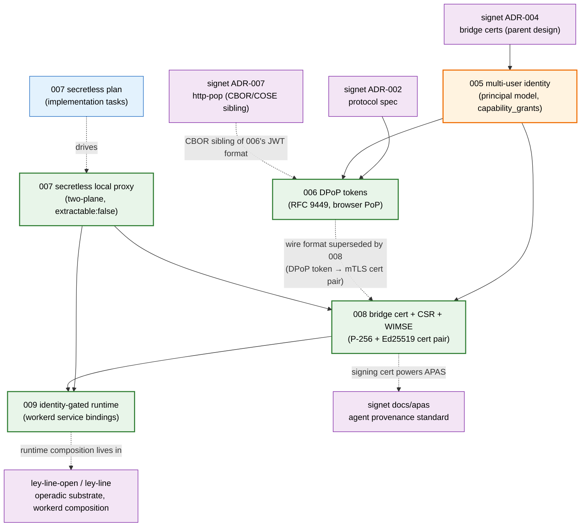

# docs

architecture decision records for notme.

## adr index

| # | title | status | one-line decision | code / files |
|---|---|---|---|---|
| **005** | [multi-user identity](design/005-multi-user-identity.md) | proposed | replace single-admin model with `principals` + `capability_grants` + invite flow; `is_admin` boolean retired in favor of capability scopes | `worker/src/auth/principals.ts`, `worker/src/auth/connections.ts` |
| **006** | [DPoP tokens](design/006-dpop-tokens.md) | accepted | sender-constrained JWT access tokens (RFC 9449); same Ed25519 master key signs certs and tokens | `worker/src/auth/dpop.ts`, `worker/src/auth/dpop-handler.ts`, `worker/src/auth/token.ts` |
| **007** | [secretless local proxy](design/007-secretless-local-proxy.md) | accepted (phase A done; phase C partial) | two-plane model — workerd holds non-extractable keys locally, edge validates independently; `extractable: false` invariant enforced everywhere | `worker/src/platform.ts`, `worker/src/signing-authority.ts`, `proxy/src/main.rs` |
| **007** | [secretless plan](design/007-secretless-plan.md) | implementation plan (sibling of design 007) | task-by-task TDD checklist for executing 007 | — (drives changes across `worker/`, `Taskfile.yml`) |
| **008** | [bridge cert + CSR + WIMSE](design/008-bridge-cert-csr-wimse.md) | accepted | proof-of-possession exchange producing a P-256 mTLS cert + Ed25519 signing cert with a shared binding extension; WIMSE identity URIs in SAN | `worker/src/cert-authority.ts`, `worker/src/cert-exchange.ts` |
| **009** | [identity-gated runtime](design/009-identity-gated-runtime.md) | accepted | workerd config pattern: agent Worker has no `globalOutbound`, talks to notme Worker via service binding only; agent cannot `fetch()` | `worker/config.capnp`, `worker/worker.ts` (`AuthService`) |

statuses come from each ADR's own header. 005 is "proposed" in-file even though the principal model has shipped (`worker/src/auth/principals.ts`); the file hasn't been promoted yet. 007 and 009 don't carry an explicit status field — labelled "accepted" here based on shipped code.

## adr dependency graph

key edges:

- **005 → 006, 008** — the principal / scope model is the identity foundation; DPoP tokens and bridge certs both carry `principalId` + `scopes` derived from `capability_grants`.
- **007 → 008** — 008 builds on 007's "private keys never leave process memory" invariant; the PoP exchange relies on `extractable: false` keypairs generated client-side.
- **006 ⇢ 008** — 008's migration table explicitly retargets the wire format from "DPoP token" to "P-256 mTLS cert + Ed25519 signing cert". 006 isn't formally superseded (the `/token` endpoint and DPoP code paths still exist for browsers), but for CLI/CI/agent contexts 008 is the canonical answer.
- **007 + 008 → 009** — 009 is the runtime that consumes both: a notme Worker holding the cert pair from 008, an agent Worker isolated by the V8 boundary 007 set up.

## why numbering starts at 005

ADRs 001–004 live in **signet** (`signet/docs/design/`):

| # | title (signet) |
|---|---|
| 001 | signet tokens (CBOR+COSE PoP) |
| 002 | signet protocol specification |
| 003 | signet SDK |
| 004 | bridge certificates for federated identity |

notme inherits the numbering — it's the cloudflare-deployed implementation of signet's identity authority, so the ADR sequence continues. signet ADR-004 is the parent design notme ADR-005 (and onward) builds on. there was no historical reset; the lower numbers simply belong to the protocol repo, not the worker repo.

## the two `007-*` files

both files are live. neither is dead.

- **`007-secretless-local-proxy.md`** — the **design**. invariants, threat model, key-storage modes, blockers, success criteria. cite this when arguing about the model.
- **`007-secretless-plan.md`** — the **implementation plan**. checkbox-style task list (Task 1 build tooling, Task 2 platform interface, ...) intended to be consumed by the `superpowers:executing-plans` skill. cite this when actually doing the work.

they share a number because the plan is scoped to the design doc — keeping them as `007-design` + `007-plan` (rather than `007` + `010`) preserves citation stability and signals "these belong together."

## where other design lives

- **APAS spec** — moved to signet at `signet/docs/apas/agent-provenance-standard.md`. notme issues the Ed25519 signing certs that sign APAS attestations (008), but the spec itself is signet's.
- **operadic substrate / workerd composition** — moved to ley-line:
  - decade `ley-line-open-9d30ac` (operadic Merkle DAG over Σ — substrate-level)
  - bead `ley-line-3278b4` (workerd-specific composition)
  - notme-side mTLS-injector chunk-spec stays in this repo as a future ADR (bead `notme-e005a8`)
- **top-level architecture** — [`../ARCHITECTURE.md`](../ARCHITECTURE.md). subsystem map, data flow, file-level pointers.
- **threat model** — [`../worker/THREAT_MODEL.md`](../worker/THREAT_MODEL.md). every row links to the test that defends it. cross-references ADR-005 (principal model), ADR-006 (DPoP JTI replay), ADR-007 (key extraction invariants), ADR-008 (cert chain), and ADR-009 (proxy boundary).
- **signet protocol siblings** — `signet/docs/design/00[1-4]*.md` for the parent ADRs; `signet/docs/design/007-http-pop.md` is the CBOR/COSE counterpart to notme ADR-006.

## conventions

- numbered sequentially. two `007-*` files exist because design and plan are split (see above); numbering is preserved for citation stability.
- ADRs are append-only. superseded ADRs get a `SUPERSEDED` header pointing at the replacement, but the file stays. (none currently superseded — 008 partially replaces 006's wire format but 006 is not formally retired.)
- cross-references use repo-relative paths (`docs/design/008-bridge-cert-csr-wimse.md`, `../worker/THREAT_MODEL.md`), not GitHub URLs — works offline and survives repo moves.
- external repo references name the bead/decade ID (e.g. `ley-line-open-9d30ac`) so rosary can resolve them across repos.
