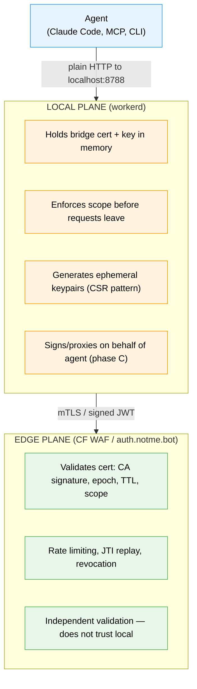
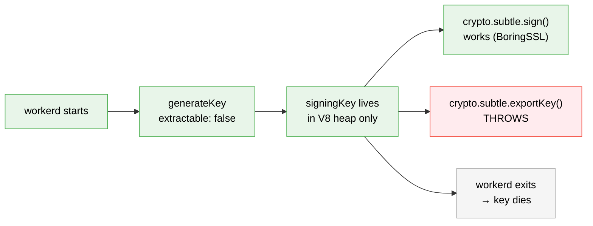

# 007: Secretless Local Proxy

> Private keys exist only in process memory unless explicitly encrypted at rest.

## Problem

The bridge cert private key currently crosses three boundaries it shouldn't:

1. **Wire**: The server generates the keypair and returns the private key over HTTPS (`worker.ts:164-195`, `cert-exchange.ts:166-203`).
2. **Disk**: The GHA action writes the private key to `$GITHUB_OUTPUT` (`action/src/index.ts:104`).
3. **SQLite**: The signing authority stores the CA private key as plaintext JWK in DO SQLite (`signing-authority.ts:152`).

A system that claims to be secretless cannot have `cat *.sqlite | strings | grep '"d"'` extract the CA key.

## Root Cause (5 Whys)

1. Why does the private key end up in `$GITHUB_OUTPUT`? — The action outputs it for downstream steps.
2. Why does the action output it? — The server generates the keypair and returns the private key.
3. Why does the server generate the keypair? — Cert exchange was "give me a cert" not "sign my key."
4. Why wasn't it CSR-based? — The consumer (action) was a dumb pipe, not a credential holder.
5. Why is the action a dumb pipe? — **There was no local runtime to hold the credential. Now there is — workerd.**

## Solution

The same Worker code runs in three contexts via the same runtime (workerd/CF Workers):

| Environment | URL | Key storage | Key lifecycle |
|---|---|---|---|
| Local dev | `localhost:8788` | In-memory only (ephemeral) | Born on startup, dies on exit |
| GHA CI | `localhost:8788` (service container) | In-memory only (ephemeral) | Born on job start, dies on job end |
| Self-hosted | `host:8788` | Encrypted at rest (HKDF-wrapped JWK in SQLite) | Persists across restarts |
| CF edge | `auth.notme.bot` | CF-managed DO SQLite | CF manages durability + encryption |

The action stops outputting `bridge_key`. It starts the local workerd (or connects to the service container) and outputs only `NOTME_URL=http://localhost:8788`. Agents talk to that URL. Private keys never leave the workerd process.

## Architecture

### Two enforcement planes



The bridge cert is the shared contract between planes. Local mints/holds/rotates it. Edge validates it. Neither trusts the other fully.

### Platform interface

A thin abstraction layer that detects the runtime and provides unified APIs:

```typescript
interface Platform {
  readonly keyStorage: KeyStorageMode;
  readonly cache: CacheStore;
  rateLimit?(key: string): Promise<boolean>;
  // Phase C: proxy?(req, identity), holdCredential?(cert)
}

interface CacheStore {
  get(key: string): Promise<string | null>;
  put(key: string, value: string, opts?: { expirationTtl?: number }): Promise<void>;
}
```

Production: `cache` wraps `env.CA_BUNDLE_CACHE` (KV). Local: `cache` uses `MemoryCache` (in-memory Map with TTL and periodic eviction). Same interface, same code paths.

### Key lifecycle (ephemeral mode)



### Key storage modes

**Ephemeral** (local dev, CI): `getOrCreateSigningKey()` generates the key with `extractable: false` and does NOT write the JWK to SQLite. The key lives only in `this.signingKey` as an opaque `CryptoKey` handle — the raw key bytes are inside BoringSSL, not on the V8 heap. `crypto.subtle.exportKey()` throws. `crypto.subtle.sign()` still works (BoringSSL signs internally). Restart = new key. `cat *.sqlite` yields nothing. No JS code path can exfiltrate the key material.

**Encrypted** (self-hosted, not yet implemented): Designed but not built. Will derive a KEK from a machine-generated secret via HKDF (`vault/src/crypto.ts`), wrap the JWK before writing to SQLite, unwrap and re-import as non-extractable on read. Currently, setting `NOTME_KEY_STORAGE=encrypted` is a hard startup error to prevent a false sense of security.

**CF-managed** (production): Current behavior, with one change: after importing the key from SQLite, re-import with `extractable: false`. CF handles encryption at rest for DO SQLite. The key is non-extractable in memory.

### Extractable flag discipline

The `extractable` flag on `crypto.subtle.generateKey()` and `importKey()` is a security boundary, not a convenience toggle. Current code uses `extractable: true` everywhere (`signing-authority.ts:136`, `signing-authority.ts:106`). This means the raw `"d"` field lives as a plain JS string on the V8 heap, readable via inspector protocol, core dumps, or swap.

**Rule: keys are `extractable: true` only for the instant they need to be serialized (encrypted mode: wrap → write → re-import as non-extractable). All other code paths use `extractable: false`.**

| Mode | generateKey extractable | importKey extractable | Why |
|------|------------------------|----------------------|-----|
| Ephemeral | `false` | N/A (no import) | Key never needs serialization |
| Encrypted | `true` → wrap → re-import `false` | `false` (after unwrap) | Extractable only during wrap operation |
| CF-managed | `true` → write JWK → re-import `false` | `false` (after read) | Extractable only during persist operation |

### KEK secret entropy requirement

HKDF-SHA256 performs zero key stretching. It is correct for high-entropy input but catastrophically weak for human-chosen passphrases. `NOTME_KEK_SECRET` must be machine-generated.

**Startup enforcement**: If `keyStorage === 'encrypted'`, validate that `NOTME_KEK_SECRET` is at least 32 hex characters (128 bits of entropy). If it is shorter, **refuse to start** with:

```
FATAL: NOTME_KEK_SECRET must be at least 128 bits (32 hex chars).
Generate with: openssl rand -hex 32
```

Do not fall back to a weaker mode. Do not attempt key stretching (PBKDF2/Argon2) — enforce entropy at the source.

### Mode detection — fail closed

Detection uses `NOTME_KEY_STORAGE` env var as the primary control:

| `NOTME_KEY_STORAGE` | `NOTME_KEK_SECRET` | Result |
|---|---|---|
| unset | unset | Auto-detect: ephemeral (convenience for local dev) |
| unset | present | Auto-detect: encrypted |
| `ephemeral` | any | Ephemeral (explicit) |
| `encrypted` | present + valid | Encrypted |
| `encrypted` | missing or too short | **REFUSE TO START** — hard error, not silent degradation |
| `cf-managed` | any | CF-managed (production) |

An attacker who can strip `NOTME_KEK_SECRET` from the environment when `NOTME_KEY_STORAGE=encrypted` causes a startup failure, not a silent downgrade. This is the correct behavior — fail closed.

## Blockers (from seam discovery)

Three issues prevent workerd from serving identity endpoints today:

### 1. Canonical host redirect (`worker.ts:889-901`)

```typescript
// Current: redirects all non-notme.bot hosts
if (!host.endsWith("notme.bot") && host !== "") {
  return Response.redirect(`https://notme.bot${pathname}${url.search}`, 301);
}
```

Fix: skip redirect when `SITE_URL` starts with `http://localhost`:

```typescript
const isLocal = (env.SITE_URL || "").startsWith("http://localhost");
if (!isLocal && !host.endsWith("notme.bot") && host !== "") {
  // redirect...
}
```

### 2. Subdomain routing (`worker.ts:905`)

```typescript
// Current: all identity endpoints gated behind subdomain check
if (sub === "auth") { /* all identity routes */ }
```

Fix: when running locally (no subdomain), treat root as the auth subdomain:

```typescript
const isAuthHost = sub === "auth" || isLocal;
if (isAuthHost) { /* all identity routes */ }
```

### 3. Missing KV binding

`CA_BUNDLE_CACHE` is used for JTI replay, bundle caching, and DPoP nonces. workerd doesn't bind it.

Fix: `Platform.cache` abstraction. Locally, JTI entries go into a `kv_cache` SQLite table in the signing authority DO:

```sql
CREATE TABLE IF NOT EXISTS kv_cache (
  key   TEXT PRIMARY KEY,
  value TEXT NOT NULL,
  expires_at INTEGER  -- unix timestamp, nullable for no-expiry
);
```

Reads check `expires_at > now`. A periodic cleanup deletes expired rows.

### 4. Build gap

No script produces `dist/worker.js` for workerd. wrangler does it implicitly for CF.

Fix: add to `package.json`:

```json
"build:local": "esbuild worker.ts --bundle --format=esm --outfile=dist/worker.js --external:cloudflare:workers"
```

And to `Taskfile.yml`:

```yaml
worker:build-local:
  desc: Bundle for local workerd
  dir: worker
  cmds:
    - npx esbuild worker.ts --bundle --format=esm --outfile=dist/worker.js --external:cloudflare:workers

worker:serve:
  desc: Run local identity authority via workerd
  dir: worker
  deps: [worker:build-local]
  cmds:
    - npx workerd serve config.capnp --experimental
```

## Security invariants

These are non-negotiable properties the implementation must maintain. Adversarial tests verify each one.

1. **No plaintext private key on disk.** In ephemeral mode, no JWK `"d"` field in any SQLite file. In encrypted mode, `"d"` is wrapped ciphertext.
2. **No extractable CryptoKey in steady state.** After key generation/import completes, `crypto.subtle.exportKey()` on the signing key must throw. Extractable is only `true` during the wrap/persist instant.
3. **Fail closed on mode misconfiguration.** `NOTME_KEY_STORAGE=encrypted` without a valid `NOTME_KEK_SECRET` is a hard startup error.
4. **No private key material in any RPC response or error message.** No method on the signing authority DO returns `"d"`, `"k"`, PEM private key headers, or raw key bytes. Error messages must not leak key material.
5. **JTI replay protection works on all platforms.** KV on CF, SQLite on local — same semantic guarantee.
6. **Constant-time comparison for security-sensitive strings.** Bootstrap codes, session tokens, and any value whose timing could leak information use HMAC-based constant-time comparison.

## Adversarial test strategy

Every endpoint gets a "try to hack it" test alongside the happy path. Tests are organized by attack vector, not by feature.

### Key extraction attacks

| Test | Attack | Expected | Invariant |
|------|--------|----------|-----------|
| `sqlite-key-extraction` | Read SQLite files, search for `"d"` (Ed25519 private key field) | Ephemeral: no `"d"` field. Encrypted: `"d"` is wrapped ciphertext. | #1 |
| `rpc-key-leak` | Call every DO RPC method, check no response contains private key material | No response contains `"d"`, `"k"`, or raw key bytes | #4 |
| `error-message-leak` | Trigger errors on every endpoint, check error messages don't contain key material | No error response contains PEM headers, JWK fields, or base64-encoded key bytes | #4 |
| `extractable-false` | After key generation/import, attempt `crypto.subtle.exportKey()` on signing key | Throws `InvalidAccessError` (non-extractable) | #2 |
| `mode-downgrade` | Set `NOTME_KEY_STORAGE=encrypted`, unset `NOTME_KEK_SECRET`, attempt startup | Startup fails with explicit error message | #3 |
| `kek-entropy-check` | Set `NOTME_KEK_SECRET=weak`, attempt startup | Startup fails — secret too short | #3 |

### Token/cert replay and forgery

| Test | Attack | Expected |
|------|--------|----------|
| `jti-replay` | Submit the same OIDC JTI twice | Second request returns 401 |
| `expired-token` | Submit a token with `exp` in the past | Returns 401 |
| `wrong-audience` | Submit a valid OIDC token with wrong `aud` | Returns 401 (confused deputy) |
| `forged-signature` | Modify JWT payload, keep original signature | Signature verification fails |
| `alg-none` | Submit JWT with `alg: "none"` | Rejected — only RS256/ES256 accepted (EdDSA not in OIDC verifier) |
| `jwk-injection` | Submit DPoP proof with attacker-controlled JWK in header | Thumbprint won't match `cnf.jkt` in access token |
| `cert-after-rotation` | Use a bridge cert signed by previous epoch's key | Edge rejects — epoch mismatch |

### Scope escalation

| Test | Attack | Expected |
|------|--------|----------|
| `scope-escalation-via-body` | Request `authorityManage` scope with `bridgeCert`-only principal | Returns only `bridgeCert` in effective scopes |
| `client-supplied-scopes` | Send scopes in passkey registration body | Server ignores client scopes, derives from admin status |
| `bootstrap-reuse` | Try to use bootstrap code twice | Second attempt returns 403 |
| `bootstrap-expired` | Try to use bootstrap code after 15-minute TTL | Returns 403 |
| `bootstrap-timing` | Measure response time for correct vs incorrect bootstrap codes | Constant-time comparison — no measurable timing difference (invariant #6) |

### Proxy boundary attacks (phase C)

| Test | Attack | Expected |
|------|--------|----------|
| `localhost-bypass` | Agent sends request to proxy claiming to be for `localhost:8788` itself | Proxy rejects self-referential requests |
| `ssrf-via-proxy` | Agent asks proxy to fetch internal metadata endpoint | Proxy enforces destination allowlist |
| `scope-mismatch` | Agent with `bridgeCert` scope asks proxy to call authority management endpoint | Proxy rejects — scope insufficient |

### Trust boundary tests

| Test | Attack | Expected |
|------|--------|----------|
| `untrusted-issuer` | OIDC token from an issuer not in `TRUSTED_ISSUERS` | JWKS fetch blocked, returns error |
| `ssrf-via-issuer` | OIDC token with `iss` pointing to internal network | `TRUSTED_ISSUERS` allowlist blocks it |
| `host-header-injection` | Send `Host: evil.com` to try to bypass routing | Canonical redirect or CORS rejection |

## Scope

### Phase A (this spec)

1. Fix the three blockers (host redirect, subdomain routing, KV)
2. Add `Platform` interface with `CacheStore` abstraction
3. Ephemeral key storage mode for local/CI
4. Encrypted key storage mode for self-hosted
5. Build script for workerd (`esbuild` + Taskfile)
6. Fix `config.capnp` (enableSql, storage path, DO bindings)
7. Adversarial tests for key extraction, replay, scope escalation
8. Container image builds and pushes to ghcr.io

### Phase C (future spec, designed for in A)

1. `Platform.proxy()` — mTLS outbound on behalf of agents
2. `Platform.holdCredential()` — in-memory credential store
3. Action starts workerd, outputs `NOTME_URL` instead of `bridge_key`
4. Agent auth for headless consumers (API key seeded at startup or TOFU)
5. Destination allowlist / routing table for proxy mode
6. TLS socket in `config.capnp` for non-localhost deployments

## Files changed

### New files
- `worker/src/platform.ts` — Platform interface, CacheStore, MemoryCache, detection, ED25519 constant
- `worker/src/auth/timing-safe.ts` — HMAC-based constant-time string comparison
- `worker/src/__tests__/adversarial.test.ts` — Adversarial security tests
- `worker/src/__tests__/platform.test.ts` — Platform detection + validation tests
- `worker/e2e/contract.spec.ts` — Playwright e2e contract tests with virtual authenticator
- `worker/test-local.sh` — workerd smoke test script
- `worker/test-e2e.sh` — Playwright e2e runner (starts workerd, extracts bootstrap code)
- `packages/melange-notme-app.yaml` — Melange package for worker bundle + config

### Modified files
- `worker/worker.ts` — Platform cache, localhost routing bypass, Cache API graceful degradation
- `worker/src/signing-authority.ts` — Ephemeral key storage, extractable:false, auto-detect mode
- `worker/src/cert-exchange.ts` — Returns access token, not private key
- `worker/src/cert-authority.ts` — ED25519 constant
- `worker/src/revocation.ts` — Guard missing KV binding
- `worker/src/auth/token.ts` — Require exp claim, SDK imports
- `worker/config.capnp` — enableSql, DO bindings, NOTME_KEY_STORAGE
- `worker/package.json` — esbuild, @playwright/test, build:local script
- `Taskfile.yml` — worker:build-local, worker:serve tasks
- `action/src/index.ts` — Output notme_url + notme_token, not bridge_key
- `action/action.yml` — New output schema
- `.github/workflows/gha-identity.yml` — Secretless workflow outputs
- `packages/apko-notme.yaml` — Add notme-app package, /data/do path

## Success criteria

1. `workerd serve config.capnp` boots and serves all identity endpoints on `localhost:8788` without `Host` header tricks
2. `cat /tmp/notme-do/*.sqlite | strings | grep '"d"'` returns nothing (ephemeral mode)
3. `crypto.subtle.exportKey("jwk", signingKey)` throws in all modes after key setup completes
4. `NOTME_KEY_STORAGE=encrypted` without `NOTME_KEK_SECRET` is a hard startup error (not silent degradation)
5. All existing 78 tests pass + new adversarial tests pass
6. `docker run -p 8788:8788 ghcr.io/agentic-research/notme:latest` works
7. Same curl commands work against localhost:8788 and auth.notme.bot
