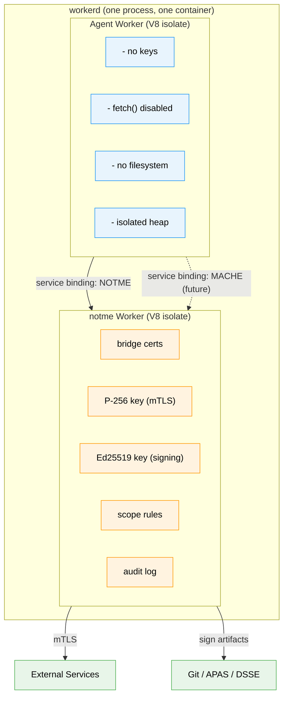
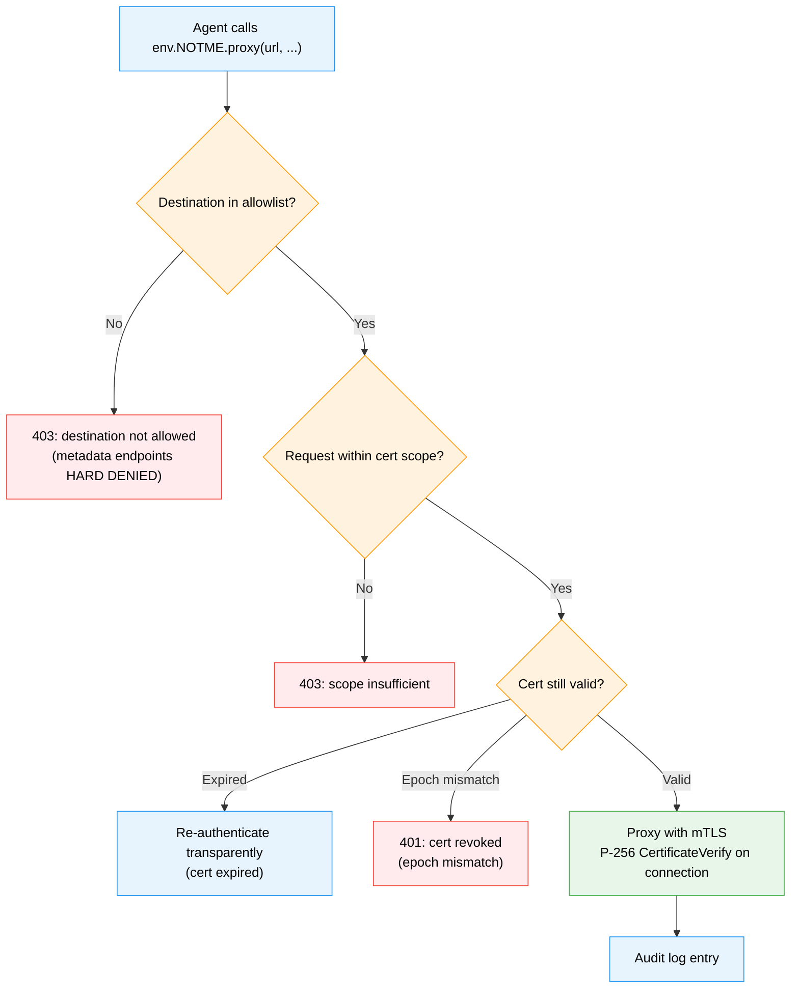
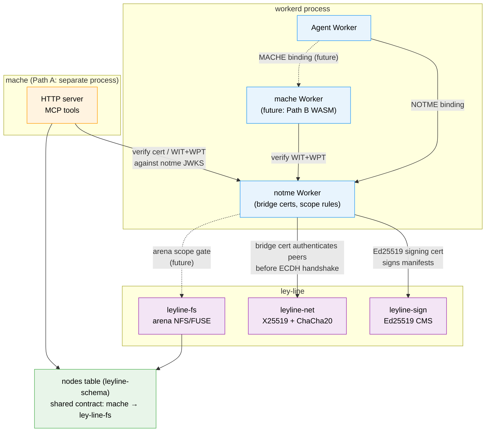
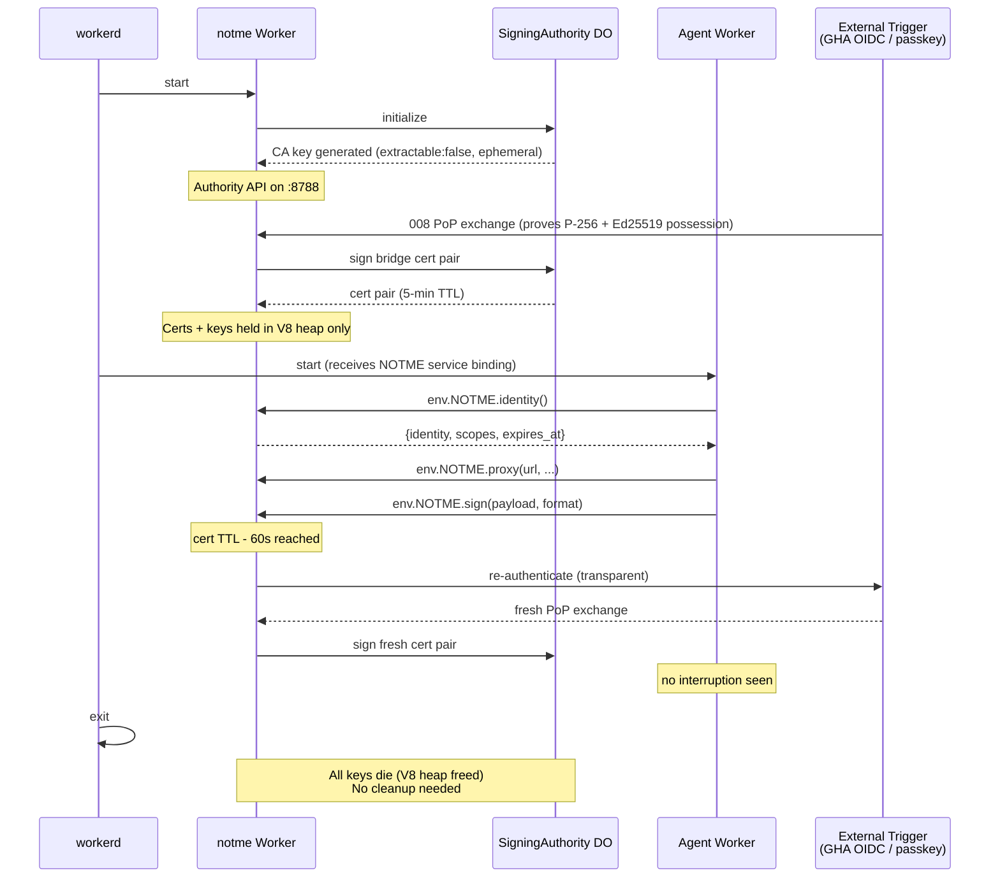

# 009: Identity-Gated Runtime

> One process. Isolated Workers. Service bindings. The agent can't reach the internet. The identity service can.

## Problem

008 defines how bridge certs are issued. This spec defines how they are **held, used, and enforced** — and how the identity service wires into the broader stack (mache, ley-line).

The traditional approach is a sidecar proxy (Istio/Envoy): a separate container that intercepts traffic. This adds operational complexity (two containers, shared networking, iptables rules) for what is fundamentally an in-process concern.

workerd (Cloudflare's open-source Workers runtime) provides **V8 isolate separation** between co-located Workers. One process, multiple Workers, service bindings for RPC. The isolation is the same mechanism that runs untrusted code on Cloudflare's edge. No separate container, no TCP, no UDS — the runtime IS the sandbox.

## Architecture



> V8 isolate boundary: Agent cannot read notme's memory, call fetch(), access the filesystem, or reach any network address.

### Why not a sidecar

| | Sidecar (Istio model) | Co-located Workers (this spec) |
|---|---|---|
| Processes | 2 (agent + proxy) | 1 (workerd) |
| Containers | 2 | 1 |
| IPC | TCP/UDS (syscalls, serialization) | Service binding (in-process, zero-copy) |
| Network enforcement | iptables/cgroup rules | `globalOutbound` not set → fetch() disabled |
| Sandbox | OS-level (namespaces, Landlock) | V8 isolate (same as CF edge, battle-tested) |
| Complexity | High (networking, port management) | Low (one capnp config) |

The container/sidecar model still works — workerd runs in Docker, and the same config applies. See [Container deployment](#container-deployment) for details.

## workerd configuration

```capnp
using Workerd = import "/workerd/workerd.capnp";

const config :Workerd.Config = (
  services = [
    # Identity + proxy service (has network access, holds keys)
    ( name = "notme",
      worker = .notmeWorker,
    ),

    # Agent service (network-isolated, talks to notme via service binding)
    ( name = "agent",
      worker = .agentWorker,
    ),

    # Internet access (only notme can use this)
    ( name = "internet",
      network = ( allow = ["public"] ),
    ),
  ],

  sockets = [
    # notme authority API (cert issuance, JWKS, discovery)
    ( name = "authority",
      address = "*:8788",
      http = (),
      service = "notme",
    ),
    # Agent entry point (if the agent exposes an API)
    ( name = "agent-api",
      address = "localhost:3000",
      http = (),
      service = "agent",
    ),
  ],
);

const notmeWorker :Workerd.Worker = (
  modules = [( name = "worker", esModule = embed "dist/notme.js" )],
  compatibilityDate = "2026-03-01",
  compatibilityFlags = ["nodejs_compat"],

  bindings = [
    ( name = "SITE_URL", text = "http://localhost:8788" ),
    ( name = "NOTME_KEY_STORAGE", text = "ephemeral" ),
    ( name = "SIGNING_AUTHORITY",
      durableObjectNamespace = "SigningAuthority" ),
    ( name = "REVOCATION",
      durableObjectNamespace = "RevocationAuthority" ),
  ],

  durableObjectNamespaces = [
    ( className = "SigningAuthority",
      uniqueKey = "signing-authority",
      enableSql = true ),
    ( className = "RevocationAuthority",
      uniqueKey = "revocation-authority",
      enableSql = true ),
  ],

  durableObjectStorage = (localDisk = "do-storage"),
  globalOutbound = "internet",  # notme CAN reach the internet (for JWKS, mTLS)
);

const agentWorker :Workerd.Worker = (
  modules = [( name = "agent", esModule = embed "dist/agent.js" )],
  compatibilityDate = "2026-03-01",

  bindings = [
    # The ONLY way the agent can interact with the outside world
    ( name = "NOTME", service = "notme" ),
  ],

  # NO globalOutbound — agent's fetch() goes nowhere
  # NO durableObjectStorage — agent has no persistent state
  # NO disk bindings — agent cannot read/write files
);
```

The critical line: `agentWorker` has **no `globalOutbound`**. The agent's `fetch()` function is disabled. The only external interaction is through the `NOTME` service binding.

## Service binding API

The agent Worker calls the notme Worker via the `NOTME` service binding. notme exports a `WorkerEntrypoint` with these RPC methods:

### Already implemented (in `worker.ts`)

```typescript
export class AuthService extends WorkerEntrypoint {
  // Mint a bridge cert (signing stays inside the DO)
  async mintBridgeCert(subject, publicKeyPem, ttlMs?): Promise<BridgeCertResult>

  // Mint a DPoP-bound access token
  async mintDPoPToken(params: { sub, scope, audience, jkt }): Promise<string>

  // Get the authority's public key
  async getPublicKeyPem(): Promise<string>

  // Get the CA certificate
  async getCACertificatePem(): Promise<string>

  // Get authority state (epoch, seqno, keyId)
  async getAuthorityState(): Promise<AuthorityState>

  // Verify a session cookie
  async verifySession(cookie): Promise<Session | null>
}
```

### New methods (this spec)

```typescript
export class AuthService extends WorkerEntrypoint {
  // ... existing methods ...

  // Proxy an HTTP request with mTLS (agent calls this instead of fetch)
  async proxy(request: {
    url: string;
    method: string;
    headers?: Record<string, string>;
    body?: string;
  }): Promise<{
    status: number;
    headers: Record<string, string>;
    body: string;
  }>

  // Sign data with the Ed25519 signing key
  async sign(payload: ArrayBuffer, format: "raw" | "dsse" | "git-commit"): Promise<{
    signature: ArrayBuffer;
    certificate: string;  // signing cert PEM (public)
    identity: string;     // wimse:// URI
  }>

  // Get current identity and capabilities
  async identity(): Promise<{
    identity: string;     // wimse://notme.bot/...
    scopes: string[];
    certificates: { mtls: string; signing: string };
    expires_at: number;
  }>
}
```

### Agent usage

```typescript
// agent.js — runs in the isolated agent Worker
export default {
  async fetch(request, env) {
    // env.NOTME is the service binding to the notme Worker

    // Make an authenticated request (notme does mTLS)
    const response = await env.NOTME.proxy({
      url: "https://api.github.com/repos/owner/repo",
      method: "GET",
      headers: { "Accept": "application/json" },
    });

    // Sign a git commit
    const commitData = new TextEncoder().encode("tree abc...\nauthor...\n\ncommit message");
    const signed = await env.NOTME.sign(commitData, "git-commit");

    // Check identity
    const me = await env.NOTME.identity();
    console.log(me.identity); // wimse://notme.bot/agent/dev-agent/dispatch/abc123

    // This DOES NOT WORK — agent has no globalOutbound:
    // await fetch("https://api.github.com/..."); // TypeError: fetch is not defined
  }
};
```

## Enforcement guarantees

### What the agent CANNOT do

| Action | Why it's blocked |
|---|---|
| `fetch("https://...")` | No `globalOutbound` — fetch is undefined |
| Read notme's keys | V8 isolate boundary — separate heap, no shared memory |
| Access the filesystem | No disk bindings in agentWorker config |
| Bypass the proxy | Service binding is the only outbound channel |
| Escalate scope | notme checks `request.scopes ⊆ cert.scopes` before proxying |
| Read other Workers' state | V8 isolates are the same mechanism CF uses for multi-tenant edge |

### What the notme Worker checks before proxying



## Destination allowlist

```json
{
  "allowed": [
    "*.notme.bot",
    "api.github.com",
    "*.cloudflare.com"
  ],
  "denied": [
    "169.254.169.254",
    "metadata.google.internal",
    "100.100.100.200",
    "fd00:ec2::254"
  ]
}
```

Cloud metadata endpoints are hard-denied (same approach as [nono](https://nono.sh)). The allowlist is configured at startup via environment variable.

## Audit trail

Every proxied request and signing operation is logged as structured JSON:

```json
{
  "ts": "2026-04-26T12:00:00Z",
  "type": "proxy",
  "identity": "wimse://notme.bot/agent/dev-agent/dispatch/abc123",
  "destination": "https://api.github.com/repos/owner/repo/pulls",
  "method": "POST",
  "scope_checked": "bridgeCert",
  "allowed": true,
  "response_status": 201,
  "duration_ms": 145
}
```

These logs feed into APAS attestations — the identity service IS the execution evidence for the agent's session. Each proxy/sign event becomes a verifiable entry in the provenance chain.

## Wiring: mache + ley-line integration



The co-located Worker model extends to the broader stack. The seams:

### mache (code intelligence)

mache is a Go binary that serves MCP tools over HTTP. Two integration paths:

**Path A (auth middleware):** mache stays as a separate process. notme adds auth middleware — mache verifies bridge cert or WIT+WPT on every MCP request against notme's JWKS.

**Path B (co-located):** mache compiles to WASM and runs as a Worker in the same workerd process. The agent calls mache via a service binding (`env.MACHE`). mache calls notme for auth. Zero HTTP overhead.

Path A is practical today. Path B requires mache's Go → WASM compilation (feasible — Go supports `GOOS=wasip1`).

### ley-line (transport + signing)

ley-line provides:
- **`leyline-net`**: UDP/TCP transport with X25519 ECDH handshake + ChaCha20-Poly1305
- **`leyline-sign`**: X.509 cert parsing + Ed25519 CMS signing
- **`leyline-fs`**: Arena mount (NFS/FUSE)

The wiring:
- **Manifest signing**: ley-line's TCP manifest includes an Ed25519 signature. Today this uses a local key. With notme, it uses the Ed25519 bridge cert — same key, same identity, verifiable by the receiver against notme's CA.
- **Transport auth**: The ECDH handshake in `leyline-net` establishes a session key. notme's bridge cert can authenticate the peers before the handshake — the receiver checks the sender's cert against the CA trust bundle.
- **Arena access**: ley-line's arena is mmap'd by both mache and ley-line-fs. Access control is filesystem-level today. With notme, arena access could be gated by bridge cert scope (e.g., `scope: arena:project-foo:read`).

### Shared contract: `nodes` table

mache ingests source code → populates a SQLite database with a `nodes` table (defined by `leyline-schema`). ley-line-open mounts that database via C FFI (`leyline-fs`). The `nodes` table is the shared contract between code intelligence and the filesystem layer.

notme doesn't touch this contract — it gates *who can query* (via mache auth) and *who can receive* (via ley-line transport auth), not *what the data looks like*.

## Credential lifecycle



## Container deployment

The workerd co-located model IS the container model. One Dockerfile:

```dockerfile
FROM notme:latest
COPY dist/agent.js /app/dist/agent.js
COPY config.capnp /app/config.capnp
# config.capnp defines both notme + agent Workers
ENTRYPOINT ["/usr/bin/workerd", "serve", "/app/config.capnp", "--experimental"]
```

For Docker Compose / Kubernetes where the agent is a separate image, the sidecar pattern still works — two containers sharing a network namespace. But the co-located model (one container, one workerd) is preferred because it's simpler and the V8 isolation is stronger than network namespace isolation.

## Relationship to nono

[nono](https://nono.sh) provides kernel-level sandboxing (Landlock/Seatbelt) and credential injection (phantom token pattern). notme provides cryptographic workload identity.

| Layer | nono | notme |
|---|---|---|
| Sandbox | Kernel (Landlock/Seatbelt) | V8 isolate (workerd) |
| Credentials | Injected (phantom token → real API key) | Issued (bridge cert, signed by CA) |
| Identity | None (uses injected creds) | WIMSE URI + cert chain |
| Audit | Kernel syscall log | Signed APAS attestation |

They compose: nono can sandbox the workerd process itself (restrict what workerd can do at the OS level), while workerd isolates the agent from the identity service internally.

## Success criteria

1. Agent Worker with no `globalOutbound` cannot call `fetch()` — confirmed by test
2. Agent can make authenticated requests via `env.NOTME.proxy()` — mTLS verified by target service
3. Agent can sign artifacts via `env.NOTME.sign()` — signature verifiable with bridge cert
4. `env.NOTME.proxy()` rejects destinations not in allowlist
5. `env.NOTME.proxy()` rejects requests exceeding cert scope
6. Cloud metadata endpoints hard-denied
7. Private keys never appear in any service binding response
8. Audit log captures every proxy + sign operation
9. Cert auto-renewal transparent to agent
10. Same config works in bare workerd, Docker, and GHA service container
