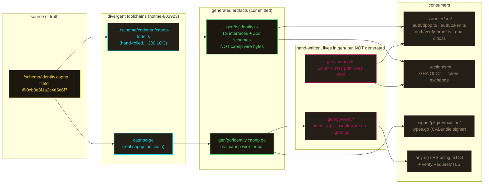

# gen

generated code from `../schema/`. **don't edit anything in here by hand** — except `go/verify/` and `ts/dpop.ts`, which are hand-written consumers / helpers (called out below).

## ⚠️ open: TS and Go paths use different toolchains

**bead `notme-803923`** + see [`../schema/README.md`](../schema/README.md) for full context.

`identity.capnp` claims cap'n proto's deterministic binary format guarantees cross-language byte equality. that's only true on the Go side right now:

- **go**: real `capnpc-go` output → real capnp wire format.
- **ts**: output of `../schema/codegen/capnp-to-ts.ts` (~280 LOC hand-rolled parser) → TS interfaces + Zod schemas, **not** capnp wire bytes.

if you're working on CABundle signature verification or anything that depends on cross-language byte equality, read the bead before you touch anything. three fix paths are on the table; decision pending.

## generation flow



## file catalog

| path | provenance | source | consumers |
|---|---|---|---|
| `ts/identity.ts` | generated by `../schema/codegen/capnp-to-ts.ts` (hand-rolled, NOT real capnp) | `../schema/identity.capnp` | `../worker/src/` (auth modules), `../action/src/` |
| `ts/dpop.ts` | **hand-written** — see file header. shared DPoP + JWT SDK (RFC 7638 thumbprint, RFC 9449 verifier, base64url, validateClaims, jsonParseSafe). pure Web Crypto, zero npm deps. | DPoP RFC 9449 + JWT RFC 7519 | `../worker/src/auth/dpop.ts`, `auth/token.ts`, `auth/verify-proof.ts`, `src/gha-oidc.ts`; any external rig/RS that verifies notme tokens |
| `ts/__tests__/dpop-verifier.test.ts` | tests for `dpop.ts` verifyDPoPToken / verifyAccessToken | — | vitest (`cd worker && npx vitest run gen/ts/__tests__/`) |
| `ts/__tests__/jwt-primitives.test.ts` | tests for `dpop.ts` exported primitives (base64url, jsonParseSafe, validateClaims) | — | vitest |
| `go/identity.capnp.go` | generated by `capnpc-go` (real capnp toolchain) | `../schema/identity.capnp` | `gen/go/verify/`, `signet/pkg/revocation/types.go` |
| `go/go.mod`, `go/go.sum` | hand-maintained Go module manifest for the gen package | — | `go build ./...` inside `gen/go/` |
| `go/verify/identity.go` | **hand-written** Go consumer — defines `Identity`, `ParseIdentity`, `VerifyClientCert`, `NewCAPool`, scope subset check, ASN.1 helpers | x509 + custom OID extensions | `gen/go/verify/middleware.go`, `grpc.go` |
| `go/verify/middleware.go` | **hand-written** — `Verifier` struct + `NewFromPEM` / `NewFromURL` constructors, `TLSConfig()`, `RequireMTLS` HTTP middleware, `IdentityFromContext` | — | any Go HTTP service that wants notme mTLS |
| `go/verify/grpc.go` | **hand-written** — gRPC `UnaryServerInterceptor` and `StreamServerInterceptor` that pull TLS peer cert and inject `*Identity` into the gRPC context | — | any gRPC service behind notme mTLS |

## `gen/go/verify/` is hand-written, NOT generated

worth saying twice. the directory lives under `gen/` because it's a tightly-coupled consumer of `gen/go/identity.capnp.go` — but it's hand-maintained Go. it provides the public consumer API for any Go service that wants to authenticate notme bridge certs:

- **`identity.go`** — `Identity` struct, x509 parsing, custom OID extensions (notme PEN arc `1.3.6.1.4.1.99999.1.*` — placeholder, replace with real IANA assignment), scope subset enforcement.
- **`middleware.go`** — `RequireMTLS` net/http middleware. one-liner integration: `mux.Handle("/api/", v.RequireMTLS(handler))`.
- **`grpc.go`** — both unary + stream gRPC interceptors. plug into `grpc.NewServer(grpc.Creds(credentials.NewTLS(v.TLSConfig())), grpc.UnaryInterceptor(v.UnaryServerInterceptor()))`.

a service needs only this package + the CA cert PEM (fetched from `https://auth.notme.bot/.well-known/ca-bundle.pem`). no notme worker, no workerd, no WIMSE library, no external deps beyond `capnproto.org/go/capnp/v3` and `google.golang.org/grpc`.

## `gen/ts/dpop.ts` is hand-written

the file header is explicit: it's a shared DPoP utilities and verifier SDK, not generated. it lives in `gen/ts/` for distribution-ergonomics reasons (one place to import from on both the issuer and verifier sides — worker mints with these primitives, RSes verify with them), but it's hand-maintained.

what's in there:

- `computeJwkThumbprint()` — RFC 7638
- `verifyDPoPToken()` — full RFC 9449 verifier (signature + jti + iat freshness + htm/htu match + `cnf.jkt` binding)
- `verifyAccessToken()` — token-only path for redirect flows (no DPoP proof, but rejects DPoP-bound tokens to prevent downgrade — see RFC 9449 §3)
- `base64urlEncode` / `base64urlDecode` — chunked base64url, jose patterns
- `jsonParseSafe` — JSON parse that rejects non-object results (jose pattern)
- `validateClaims` — exp / nbf / iat / iss / aud / sub validator with clock tolerance
- `KVLike` — minimal CF-KV-shaped interface for JWKS caching

patterns adapted from [jose](https://github.com/panva/jose) (MIT, Filip Skokan). zero npm runtime deps.

## regenerate

```bash
task schema:ts     # regenerate gen/ts/identity.ts
task schema:go     # regenerate gen/go/identity.capnp.go
task schema:all    # both
task schema:check  # diff against checked-in gen/ — fails if stale
```

CI runs `task schema:check`. if you change `../schema/identity.capnp`, regenerate AND commit the regenerated files in the same PR.

`gen/ts/dpop.ts` and `gen/go/verify/*` are hand-written — `task schema:*` does not touch them.

## why generated code is committed

per the workerd / mache RTFM precedent: committing the artifact eliminates version-skew between developers' local capnp installs. consumers (worker bundling, `go build ./...`, signet, downstream rigs) just import — they don't re-run the generators on every build. the TS generator is run explicitly via `task schema:ts`; the Go generator via `task schema:go`. neither is wired into a default `build` step.

caveat: the capnp toolchain itself isn't pinned yet. the RTFM recommends pinning compiler + generators + runtimes by exact version with a cross-runtime fixture suite. notme does neither; tracked in `notme-803923` tier 2.

## related

- **[`../schema/`](../schema/)** — the source of truth (`identity.capnp` + `codegen/capnp-to-ts.ts`).
- **[`../worker/src/`](../worker/src/)** — TS consumer. `auth/dpop.ts`, `auth/token.ts`, `auth/verify-proof.ts`, `gha-oidc.ts` all import from `gen/ts/dpop.ts`. type imports from `gen/ts/identity.ts`.
- **[`../action/`](../action/)** — TS consumer (GHA OIDC → token exchange). references the schema as the source of truth.
- **`signet/pkg/revocation/types.go`** — Go consumer of `gen/go/identity.capnp.go`. signs CABundle on the signet side; worker verifies with the same wire format. this is exactly the cross-language byte-equality path that `notme-803923` is about.
- **[`../docs/design/008-bridge-cert-csr-wimse.md`](../docs/design/008-bridge-cert-csr-wimse.md)** — what `BridgeCertPair` and the WIMSE identity URI represent.
- **[`../docs/design/006-dpop-tokens.md`](../docs/design/006-dpop-tokens.md)** — DPoP wire format, TS-only via `gen/ts/dpop.ts`.
