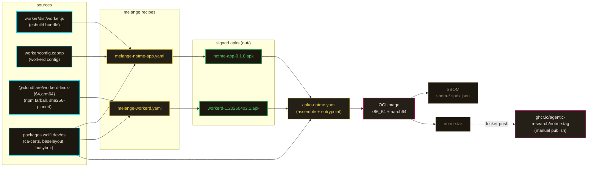

# packages

melange + apko build inputs for the self-hosted notme OCI image. distroless, multi-arch, signed.

this is the self-hosted path. the hosted variant (`auth.notme.bot`) runs on Cloudflare Workers — see the top-level [README](../README.md#run-your-own).

## pipeline



## recipes

| file | builds | key deps | arch |
|---|---|---|---|
| `melange-notme-app.yaml` | `notme-app` apk — installs `dist/worker.js` to `/app/dist/` and `config.capnp` to `/app/` | wolfi `busybox` (build-time) | aarch64, x86_64 |
| `melange-workerd.yaml` | `workerd` apk — fetches sha256-pinned `@cloudflare/workerd-linux-{64,arm64}` npm tarball, installs binary to `/usr/bin/workerd` | wolfi `busybox`, runtime: `ca-certificates-bundle` | aarch64, x86_64 |
| `apko-notme.yaml` | OCI image — combines `notme-app` + `workerd` + wolfi base, runs as uid 1000, entrypoint `/usr/bin/workerd serve /app/config.capnp --experimental` | wolfi `ca-certificates-bundle`, `wolfi-baselayout`; local `./out` for the two melange apks | aarch64, x86_64 (multi-arch index) |

recipes are self-contained — pull from `packages.wolfi.dev/os` and the local `./out` apk repo. no third-party melange tap.

## build locally

```bash
# bundle the worker (input artifact)
cd worker && npm ci && npm run build:local
cd ..

# generate a local melange signing key (one-time, never commit)
cd packages
melange keygen melange.rsa

# build the two apks (per-arch — repeat for x86_64 if needed)
melange build melange-notme-app.yaml \
  --arch aarch64 \
  --signing-key melange.rsa \
  --out-dir ./out \
  --source-dir ../worker/

melange build melange-workerd.yaml \
  --arch aarch64 \
  --signing-key melange.rsa \
  --out-dir ./out

# assemble the OCI image
apko build apko-notme.yaml \
  ghcr.io/agentic-research/notme:dev \
  notme.tar \
  --keyring-append melange.rsa.pub \
  --arch aarch64

# load + run
docker load < notme.tar
docker run -p 8788:8788 ghcr.io/agentic-research/notme:dev-arm64
```

`apko build` also emits `sbom-aarch64.spdx.json` (per-arch) and `sbom-index.spdx.json` (multi-arch index) alongside the tarball.

## distribution

published images live at `ghcr.io/agentic-research/notme:<tag>` (manual `docker push` for now — no CI publish workflow yet; only `worker/` and `proxy/` are gated by `.github/workflows/ci.yml`).

production signing keys are CI/maintainer secrets, not the local `melange.rsa` here. the local key is throwaway: regenerate per-machine, never check it in. `melange.rsa.pub` is required at `apko build` time via `--keyring-append` so apko can verify the freshly-built apks in `./out`.

## gitignored

build outputs are ignored — they're regenerable from these recipes plus `worker/dist/worker.js`:

```
packages/out/                       # apk repo melange writes to
packages/*.tar                      # apko OCI tarballs (notme.tar, notme-base.tar)
packages/sbom-*.spdx.json           # apko SBOMs
packages/melange.rsa                # local-only signing key
packages/melange.rsa.pub            # local-only public key
```

if these show up in `git status`, you ran a build. don't `git add` them.

## related

- [`../worker/config.capnp`](../worker/config.capnp) — workerd config baked into `/app/config.capnp` by `melange-notme-app.yaml`.
- [`../worker/dist/worker.js`](../worker/) — esbuild bundle (`task worker:build-local`) embedded at `/app/dist/worker.js`.
- [top-level README — run your own](../README.md#run-your-own) — the three deploy paths (workerd, container, CF Workers).
- hosted variant: `auth.notme.bot` runs the same code on CF Workers; see top-level README.
