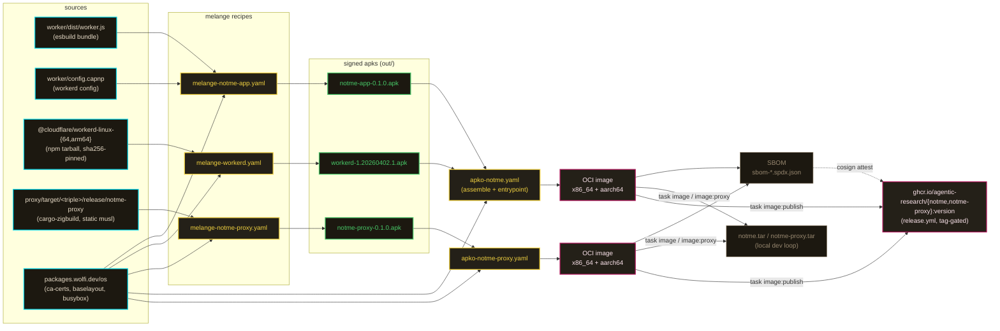

# packages

melange + apko build inputs for the two notme OCI images. distroless, multi-arch, signed.

| image | what it is |
|---|---|
| `ghcr.io/agentic-research/notme` | the identity authority — workerd + the worker bundle, listening on 8788 |
| `ghcr.io/agentic-research/notme-proxy` | the mTLS forward proxy — holds the bridge cert in process memory and presents it on outbound TLS |

they ship separately because a cloister cluster runs them as two separate hypervisor-tier bundles (`notme-identity` and `notme-proxy`), derived independently per cloister ADR-0038. they share a release tag, not a lifecycle.

this is the self-hosted path. the hosted variant (`auth.notme.bot`) runs on Cloudflare Workers — see the top-level [README](../README.md#run-your-own).

## pipeline


```mermaid
flowchart LR
    classDef src fill:#1c1810,stroke:#00d4e8,stroke-width:2px,color:#e8dcc8
    classDef recipe fill:#242018,stroke:#f0d040,stroke-width:2px,color:#f0d040
    classDef apk fill:#1c1810,stroke:#48c868,stroke-width:2px,color:#48c868
    classDef img fill:#242018,stroke:#ad1457,stroke-width:2px,color:#fce4ec
    classDef out fill:#1c1810,stroke:#988870,stroke-width:1px,color:#988870

    subgraph sources ["sources"]
        WJS["worker/dist/worker.js<br/>(esbuild bundle)"]:::src
        CAP["worker/config.capnp<br/>(workerd config)"]:::src
        WD["@cloudflare/workerd-linux-{64,arm64}<br/>(npm tarball, sha256-pinned)"]:::src
        RS["proxy/target/&lt;triple&gt;/release/notme-proxy<br/>(cargo-zigbuild, static musl)"]:::src
        WOLFI["packages.wolfi.dev/os<br/>(ca-certs, baselayout, busybox)"]:::src
    end

    subgraph melange ["melange recipes"]
        M1["melange-notme-app.yaml"]:::recipe
        M2["melange-workerd.yaml"]:::recipe
        M3["melange-notme-proxy.yaml"]:::recipe
    end

    subgraph apks ["signed apks (out/)"]
        A1["notme-app-0.1.0.apk"]:::apk
        A2["workerd-1.20260402.1.apk"]:::apk
        A3["notme-proxy-0.1.0.apk"]:::apk
    end

    APKO["apko-notme.yaml<br/>(assemble + entrypoint)"]:::recipe
    APKO2["apko-notme-proxy.yaml"]:::recipe
    IMG["OCI image<br/>x86_64 + aarch64"]:::img
    IMG2["OCI image<br/>x86_64 + aarch64"]:::img
    SBOM["SBOM<br/>sbom-*.spdx.json"]:::out
    TAR["notme.tar / notme-proxy.tar<br/>(local dev loop)"]:::out
    GHCR["ghcr.io/agentic-research/{notme,notme-proxy}:version<br/>(release.yml, tag-gated)"]:::img

    WJS --> M1
    CAP --> M1
    WD --> M2
    RS --> M3
    WOLFI --> M1 & M2 & M3 & APKO & APKO2

    M1 --> A1
    M2 --> A2
    M3 --> A3

    A1 --> APKO
    A2 --> APKO
    A3 --> APKO2
    APKO --> IMG
    APKO2 --> IMG2
    IMG & IMG2 --> SBOM
    IMG & IMG2 -->|task image / image:proxy| TAR
    IMG & IMG2 -->|task image:publish| GHCR
    SBOM -.->|cosign attest| GHCR
```

note the cross-compile sits OUTSIDE melange. no melange recipe here compiles anything — workerd is a prebuilt npm download, notme-app is a prebuilt esbuild bundle, and notme-proxy is a prebuilt cargo-zigbuild binary. melange only ever runs `install`, so building the aarch64 leg on an amd64 runner needs qemu for a file copy rather than for a full cargo build.

## recipes

| file | builds | key deps | arch |
|---|---|---|---|
| `melange-notme-app.yaml` | `notme-app` apk — installs `dist/worker.js` to `/app/dist/` and `config.capnp` to `/app/` | wolfi `busybox` (build-time) | aarch64, x86_64 |
| `melange-workerd.yaml` | `workerd` apk — fetches sha256-pinned `@cloudflare/workerd-linux-{64,arm64}` npm tarball, installs binary to `/usr/bin/workerd` | wolfi `busybox`, runtime: `ca-certificates-bundle` | aarch64, x86_64 |
| `melange-notme-proxy.yaml` | `notme-proxy` apk — installs the prebuilt `cargo-zigbuild` binary to `/usr/bin/notme-proxy` | wolfi `busybox`, runtime: `ca-certificates-bundle` | aarch64, x86_64 |
| `apko-notme.yaml` | OCI image — combines `notme-app` + `workerd` + wolfi base, runs as uid 1000, entrypoint `/usr/bin/workerd serve /app/config.capnp --experimental` | wolfi `ca-certificates-bundle`, `wolfi-baselayout`; local `./out` for the two melange apks | aarch64, x86_64 (multi-arch index) |
| `apko-notme-proxy.yaml` | OCI image — `notme-proxy` + wolfi base, runs as uid 1000, entrypoint `/usr/bin/notme-proxy`. no args: cert/key paths and listen address are deploy-time concerns | wolfi `ca-certificates-bundle`, `wolfi-baselayout`; local `./out` | aarch64, x86_64 (multi-arch index) |

recipes are self-contained — pull from `packages.wolfi.dev/os` and the local `./out` apk repo. no third-party melange tap.

## build locally

```bash
# bundle the worker (input artifact)
cd worker && npm ci && npm run build:local
cd ..

# generate a local melange signing key (one-time, never commit)
cd packages
melange keygen melange.rsa

# build the two apks (per-arch — repeat for x86_64 if needed)
melange build melange-notme-app.yaml \
  --arch aarch64 \
  --signing-key melange.rsa \
  --out-dir ./out \
  --source-dir ../worker/

melange build melange-workerd.yaml \
  --arch aarch64 \
  --signing-key melange.rsa \
  --out-dir ./out

# assemble the OCI image
apko build apko-notme.yaml \
  ghcr.io/agentic-research/notme:dev \
  notme.tar \
  --keyring-append melange.rsa.pub \
  --arch aarch64

# load + run
docker load < notme.tar
docker run -p 8788:8788 ghcr.io/agentic-research/notme:dev-arm64
```

`apko build` also emits `sbom-aarch64.spdx.json` (per-arch) and `sbom-index.spdx.json` (multi-arch index) alongside the tarball.

or just use the Taskfile, which wraps all of the above:

```bash
task image          # notme      -> packages/notme.tar
task image:proxy    # notme-proxy -> packages/notme-proxy.tar
```

both default to the host arch — the local loop only wants the one it can run. `task image:publish` overrides with both.

### notme-proxy specifically

the binary is cross-compiled ahead of melange, natively:

```bash
task proxy:build:cross   # cargo zigbuild --release --target {x86_64,aarch64}-unknown-linux-musl
```

musl because the proxy uses rustls with `ring` and never OpenSSL, so a static binary drops the libc dependency from the image entirely. requires `cargo-zigbuild` and `ziglang`.

the resulting image ships no cert and no key — the private key never exists in a layer, only in the process's memory once mounted at runtime:

```bash
docker run -v "$PWD/certs:/run/notme:ro" \
  ghcr.io/agentic-research/notme-proxy:0.1.0 \
  --cert /run/notme/bridge-cert.pem \
  --key  /run/notme/bridge-key.pem \
  --listen 0.0.0.0:1080
```

## distribution

published by [`.github/workflows/release.yml`](../.github/workflows/release.yml) on a `v*` tag:

```
git tag v0.1.0 && git push --tags
  -> ghcr.io/agentic-research/notme:0.1.0
  -> ghcr.io/agentic-research/notme-proxy:0.1.0
```

**the `v` is stripped.** a `v0.1.0` tag publishes `:0.1.0`. the `v` prefix is a per-repo convention, not a mandate (rosary strips; mache and ley-line-open keep), and notme strips it so cloister's existing `notme:0.1.0` reference registry-qualifies by gaining a prefix rather than by rewriting a version.

the two images publish as **independent jobs**. cloister derives them separately, so a notme-proxy failure must not cancel a healthy notme publish.

### the version guard

`server.json` `packages[].version` must equal **the tag the publish job actually pushes** — because `<identifier>:<version>` has to resolve at the registry (cloister ADR-0041 §2). that is not the same as "matches the git tag": those differ whenever the tag is `v`-prefixed, and checking the git tag would pass while the registry 404s.

so `task image:publish` runs `task version:check` against the *same* `VERSION` variable it tags with, before pushing anything:

```bash
task version:check VERSION=0.1.0
```

it checks each `packages[]` entry independently — a correct `notme` alongside a stale `notme-proxy` is a reachable state — and rejects an **absent** version as firmly as a wrong one. that second half is the one that matters: ley-line-open v0.11.2 shipped through a guard that rejected a tagged identifier but permitted a missing version, so a broken shape went out through a guard written to prevent it.

`scripts/check-image-versions.ts` also asserts the two notme melange recipes track the release tag. `melange-workerd.yaml` is deliberately exempt — its version is workerd's, not ours.

**prereleases use two spellings, on purpose.** apk reserves `-r<N>` for the package release suffix, so `0.1.0-rc1` is not a legal apk version — melange rejects it outright (`invalid version 0.1.0-rc1, could not parse`). The same version is spelled `0.1.0_rc1` in apk. So for a `v0.1.0-rc1` tag:

| file | value |
|---|---|
| `server.json` `packages[].version` | `0.1.0-rc1` — must equal the pushed OCI tag exactly |
| `melange-notme-app.yaml`, `melange-notme-proxy.yaml` | `0.1.0_rc1` — apk spelling |

`version:check` knows the mapping (`-` → `_`) and checks each against the right form. apk's suffix grammar is narrower than semver's, so an exotic tag like `0.1.0-beta.2` maps to `0.1.0_beta.2` and melange will reject it at build time — the check doesn't reimplement apk's grammar.

### signing

each image is signed by digest, not by tag — a tag is mutable and a re-push would strand the signature:

```bash
cosign verify ghcr.io/agentic-research/notme:0.1.0 \
  --certificate-identity-regexp '^https://github.com/agentic-research/notme/' \
  --certificate-oidc-issuer https://token.actions.githubusercontent.com
```

the apko-emitted SPDX SBOM is attached as an in-toto attestation against the same digest (`cosign attest --type spdxjson`). keyless OIDC — no signing secret to store or rotate.

**the melange signing key is ephemeral in CI**, generated per run by `task image:keygen`. the apks it signs are consumed by apko within the same job and never published as an apk repo, so the signature is an intra-job integrity check with no external consumer. a persistent key would be a secret to guard and rotate for no gain; the real supply-chain property is the cosign signature on the image digest.

locally the same applies — the `melange.rsa` here is throwaway: regenerate per-machine, never check it in. `melange.rsa.pub` is required at `apko build` time via `--keyring-append` so apko can verify the freshly-built apks in `./out`.

## gitignored

build outputs are ignored — they're regenerable from these recipes plus `worker/dist/worker.js` and `proxy/target/`:

```
packages/out/                       # apk repo melange writes to
packages/*.tar                      # apko OCI tarballs (notme.tar, notme-proxy.tar, notme-base.tar)
packages/sbom-*.spdx.json           # apko SBOMs
packages/melange.rsa                # local-only signing key
packages/melange.rsa.pub            # local-only public key
```

if these show up in `git status`, you ran a build. don't `git add` them.

## related

- [`../worker/config.capnp`](../worker/config.capnp) — workerd config baked into `/app/config.capnp` by `melange-notme-app.yaml`.
- [`../worker/dist/worker.js`](../worker/) — esbuild bundle (`task worker:build-local`) embedded at `/app/dist/worker.js`.
- [`../proxy/README.md`](../proxy/README.md) — the mTLS proxy itself: two-plane model, transport modes, the UDS companion role.
- [`../server.json`](../server.json) — declares both images as `packages[].oci`. the manifest consumers read to derive `<identifier>:<version>`; `task version:check` keeps it honest.
- [`../.github/workflows/release.yml`](../.github/workflows/release.yml) — the tag-gated publish.
- [`../scripts/check-image-versions.ts`](../scripts/check-image-versions.ts) — the version guard, and why it checks both halves of the rule.
- [top-level README — run your own](../README.md#run-your-own) — the three deploy paths (workerd, container, CF Workers).
- hosted variant: `auth.notme.bot` runs the same code on CF Workers; see top-level README.
