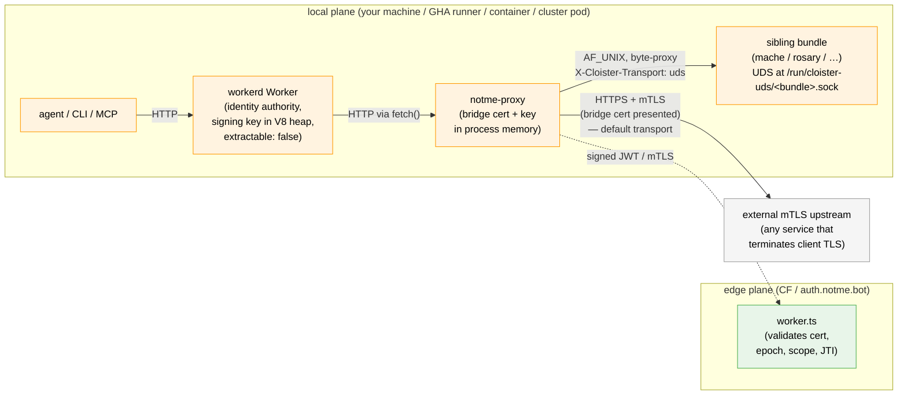
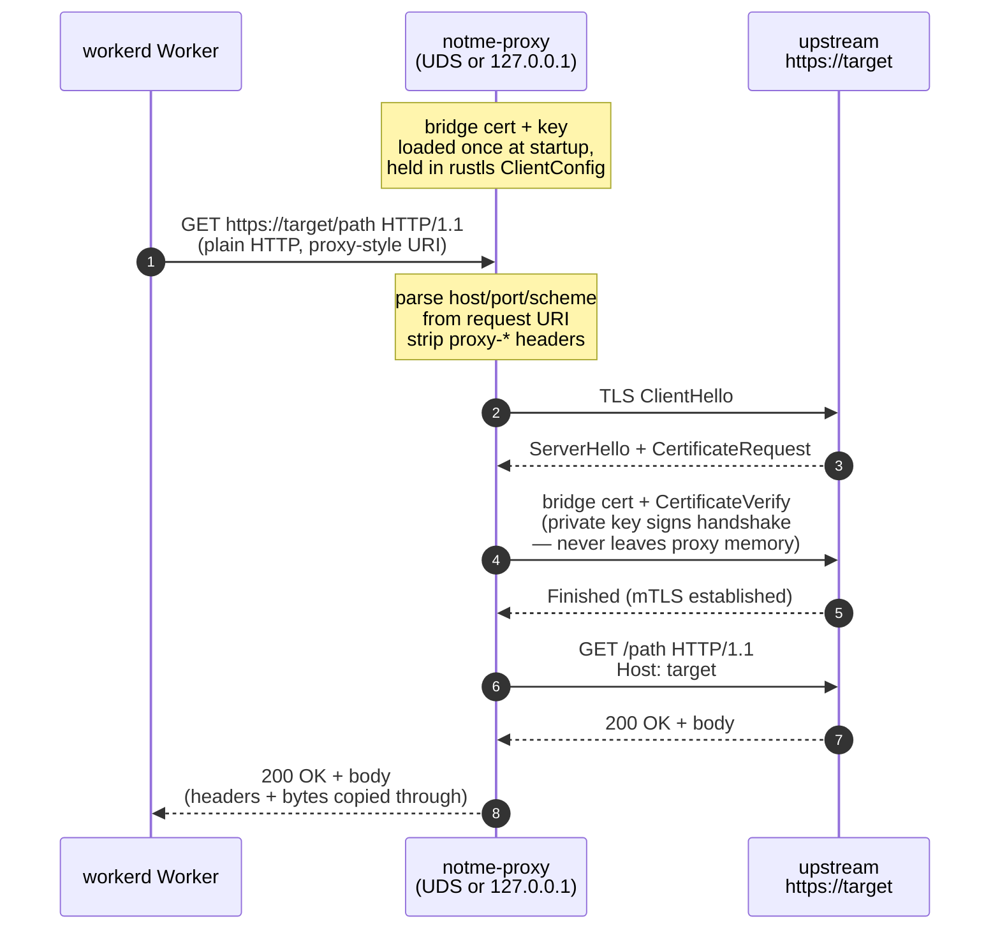

# proxy

`notme-proxy` — Rust mTLS forward proxy. The **local plane** of notme's two-plane identity model.

a single-binary HTTP proxy that holds a bridge cert + private key in process memory and presents them on outbound TLS handshakes. workerd Workers `fetch()` plain HTTP at the proxy; the proxy speaks HTTPS + mTLS at the upstream.

the private key never enters any Worker, never touches disk, never leaves this process.

## why

CF production has mTLS as a platform binding. local workerd has no equivalent. without this proxy, local development can't exercise the mTLS code path — with it, the wire shape matches prod.

local plane: edge validates, local proxy holds. see [`../docs/design/007-secretless-local-proxy.md`](../docs/design/007-secretless-local-proxy.md) (Phase C) and [`../docs/design/008-bridge-cert-csr-wimse.md`](../docs/design/008-bridge-cert-csr-wimse.md) for the cert format.

## two-plane placement



## proxy flow



key never crosses the W↔P boundary. workerd only sees plain HTTP.

## CLI

| flag | default | what |
|---|---|---|
| `--cert` | `bridge-cert.pem` | PEM cert chain to present as the client cert |
| `--key` | `bridge-key.pem` | PEM private key paired with `--cert` |
| `--listen` | `127.0.0.1:1080` | listen address — TCP `host:port` or `unix:/path/to/sock` |

| env var | default | what |
|---|---|---|
| `NOTME_UDS_PREFIX` | `/run/cloister-uds/` | required prefix for `X-Cloister-Socket-Path`; see transport modes below |

UDS *listen* mode binds with mode `0600` (owner-only). anyone who can `connect()` to the socket fetches as the bridge identity, so perms are tightened immediately after bind.

stale socket files are removed before bind, but only if `symlink_metadata` says the existing path is a real socket — a typo like `--listen unix:./bridge-cert.pem` will refuse to clobber the cert.

plain `http://` upstreams are forwarded without TLS (no cert presented). only `https://` triggers the mTLS path.

## transport modes

each request selects a transport via the `X-Cloister-Transport` request header. the proxy dispatches on the header value at the top of the request handler:

| header value | behavior |
|---|---|
| *(absent)* or `mtls` | existing mTLS forward path (parse proxy-style URI, dial upstream with bridge cert) |
| `uds` | dial `AF_UNIX` to the path in `X-Cloister-Socket-Path`, write request body, half-close, return response bytes verbatim |
| anything else | `400 Bad Request` (a typo doesn't get a request sent across the wrong wire) |

### uds transport (companion role)

when `X-Cloister-Transport: uds`, notme-proxy is acting as **cloister-companion** — the in-pod IPC seam for traffic workerd can't speak directly. cloister-router POSTs a capnp `ToolCall` as the request body, the proxy connects to the sibling-bundle's UDS, half-closes the write side (so the upstream sees EOF and starts responding), reads the response bytes, and returns them in a `200 OK` with `Content-Type: application/x-capnp; type=ToolResult`.

```mermaid
sequenceDiagram
    autonumber
    participant W as cloister-router<br/>(workerd)
    participant P as notme-proxy<br/>(companion role)
    participant U as sibling bundle<br/>(mache / rosary / …)<br/>UDS at /run/cloister-uds/<bundle>.sock

    Note over W,P: same plain HTTP face as mTLS mode
    W->>P: POST /<any> HTTP/1.1<br/>X-Cloister-Transport: uds<br/>X-Cloister-Socket-Path: /run/cloister-uds/mache.sock<br/>body: capnp ToolCall bytes
    Note over P: validate socket path<br/>(prefix, no ..,<br/>no control chars,<br/>basename = <bundle>.sock)
    P->>U: AF_UNIX connect + write ToolCall bytes
    P-->>U: shutdown(WRITE) — half-close
    Note over U: read until EOF<br/>encode ToolResult<br/>write back, then close
    U-->>P: ToolResult bytes
    P-->>W: 200 OK<br/>Content-Type: application/x-capnp; type=ToolResult<br/>body: ToolResult bytes verbatim
```

### path validation (security)

`X-Cloister-Socket-Path` is attacker-controllable in principle (any caller that can hit notme-proxy's listen socket can set it). validation is strict — failures return `400` (not `502`):

| check | error |
|---|---|
| header present and non-empty | `Missing` |
| starts with `NOTME_UDS_PREFIX` (default `/run/cloister-uds/`) | `BadPrefix` |
| no `..` path component (defeats `/run/cloister-uds/../etc/passwd`) | `Traversal` |
| no control characters (NUL, CR, LF, etc) | `BadChars` |
| basename matches `^[a-z0-9_-]+\.sock$` | `BadName` |

paths are NOT canonicalized via `fs::canonicalize` — that would resolve symlinks and could expose paths the operator wired up intentionally as indirection. literal prefix-matching is the stronger contract: whoever controls the dir contents controls what's reachable.

connect/IO failures after validation passes return `502 Bad Gateway` with a small JSON error body. a peer that accepts but never writes a response will time out after 30 seconds and return `502` rather than blocking the request forever.

### deployment

the production image (`packages/apko-notme.yaml`) declares `/run/cloister-uds/` with `uid:gid = 1000:1000` and `0o755` so the notme user can `connect()` to sibling sockets. the container runtime (see cloister's `cluster.compose.yaml`) mounts the shared volume at deploy time; sibling bundles create their `<bundle>.sock` files with cluster-internal perms.

see also: [cloister `docs/adr/0005-internal-wire-leyline-net.md`](https://github.com/agentic-research/cloister/blob/main/docs/adr/0005-internal-wire-leyline-net.md) (the 2026-04-30 amendment classifies cloister↔companion as IPC, not full leyline-net wire), and cloister bead `cloister-46fc1a` (the change that wired `udsForward` to call out through the companion seam).

## build & run

```bash
cd proxy
cargo build --release
./target/release/notme-proxy \
  --cert bridge-cert.pem \
  --key bridge-key.pem \
  --listen 127.0.0.1:1080
# or UDS:
./target/release/notme-proxy \
  --cert bridge-cert.pem \
  --key bridge-key.pem \
  --listen unix:/run/notme/mtls.sock
```

from the repo root: `task proxy:check` runs `cargo build --locked`, `cargo test --locked`, and `cargo clippy --locked --tests -- -D warnings`.

## tests

```bash
cd proxy && cargo test
# 26 tests — listen-addr parsing (TCP, UDS abs, UDS rel, empty, invalid),
# stale-socket handling (absent / regular file / symlink-to-regular-file),
# UDS bind (perms 0600, stale replace, accept round-trip),
# UDS path validation (prefix, traversal, control chars, sock-name shape),
# UDS proxy integration (happy-path round-trip, 400 on bad path, 502 on connect failure)
```

no integration tests against a real HTTPS upstream — the mTLS forward path is exercised by the worker's e2e suite. the UDS path has hermetic integration tests (a `UnixListener` in-process plays the sibling-bundle role).

## entry point

- **`src/main.rs`** — single file. hyper 1 server + rustls 0.23 + tokio. `parse_listen_addr`, `try_remove_socket_file`, `bind_unix_listener`, `load_certs_and_key`, `build_mtls_config`, `dispatch` (header-based transport selection), `handle_proxy` (mTLS path), `handle_uds` (UDS path), `validate_uds_path`, `proxy_to_uds`, `spawn_conn`, `main`.

## hard architectural constraint

`notme-proxy` is intentionally NOT extracted into a generic `cloister-companion`. the in-memory key lives here and only here.

per the operadic-substrate ADRs (`notme-e005a8`, `ley-line-3278b4`), even when bound by other deployments as a chunk, the cert + key never cross a chunk boundary. any cloister-side capability that wants identity-attached outbound calls binds `notme-proxy` as a chunk; the cert never leaves the proxy's address space.

## what does NOT live here

- **no key persistence** — both cert and key are loaded from PEM at startup into a `rustls::ClientConfig` and held in an `Arc`. nothing is written. restart loses nothing because nothing was kept.
- **no CF dependency** — the proxy doesn't know `auth.notme.bot` exists. it forwards to whatever host the caller names in the request URI.
- **no workerd dependency** — the proxy speaks HTTP/1.1 over TCP or UDS. anything that can issue an HTTP proxy-style request works (curl `--proxy`, Go `http.Transport.Proxy`, etc.).
- **no cert issuance** — the proxy doesn't talk to the authority, doesn't request certs, doesn't rotate. operators (or the action) hand it cert + key paths and that's it.
- **no destination allowlist** *(yet — see ADR 007 Phase C item 5)*. the proxy currently forwards to any HTTPS upstream the caller names.
- **no agent auth on the listen socket** *(yet — Phase C item 4)*. on TCP, anyone who can reach `127.0.0.1:1080` fetches as the bridge. on UDS, the `0600` mode is the only gate.

## related

- [`../worker/`](../worker/) — edge plane. issues the cert this proxy holds, validates it on the way back in.
- [`../action/`](../action/) — GHA action. runs workerd in a service container; the action pattern also gets a bridge cert for CI-side identity exchange.
- [`../docs/design/007-secretless-local-proxy.md`](../docs/design/007-secretless-local-proxy.md) — design ADR. Phase C documents this crate.
- [`../docs/design/008-bridge-cert-csr-wimse.md`](../docs/design/008-bridge-cert-csr-wimse.md) — cert format the proxy presents (WIMSE SAN, dual-cert P-256/Ed25519).
- memory: `project_secretless_proxy.md` (bead `notme-724300`) — two-plane summary.
