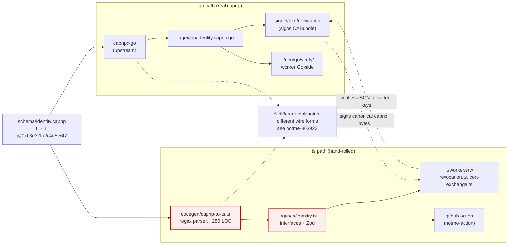

# schema

Cap'n Proto schemas — declared single source of truth for cross-language types in the notme identity stack.

## ⚠️ open issue: TS path doesn't use real capnp wire format

**Status (2026-05-09):** see bead `notme-803923` (P0, security-relevant).

`identity.capnp` claims at the top of the file:

> "Cap'n Proto's deterministic binary format guarantees this [cross-language byte equality]."

In practice this is **false on the TS side**:

- **Go side** (`../gen/go/identity.capnp.go`) — real `capnpc-go` output. Real capnp segments, pointers, canonical form.
- **TS side** (`../gen/ts/identity.ts`) — output of `codegen/capnp-to-ts.ts` (~280 LOC hand-rolled regex parser). Emits TS interfaces + Zod schemas. Does **not** produce capnp wire bytes — there is no segment table, no pointer layout, no canonical encoder.
- **`../worker/src/revocation.ts::bundleCanonical()`** (line 159) — computes `JSON.stringify` over sorted keys. Not capnp canonical bytes. The CABundle signature is therefore being verified against a hash of JSON, not against a hash of the capnp message Go signed.

If you are touching CABundle signature verification, oracle responses, attestation predicates, or anything that assumes "the bytes Go signs are the bytes TS verifies" — **read bead `notme-803923` first.**

Three fix paths in the bead, decision pending:

1. **TS-real-capnp** — replace `capnp-to-ts.ts` with the upstream `capnpc-ts` runtime. Heaviest lift, fully fixes the lie.
2. **Schema-honest-about-JSON** — strike the docstring claim, declare JSON canonicalization as the wire format, document the JSON canonicalization rules (key order, number repr, byte encoding) as load-bearing. Cheapest. Closes the lie but locks us into JSON.
3. **wasm bridge** — compile real capnp into a WASM module, call it from TS for canonical encode/decode only. Middle ground.

Tier 2 fix in the same bead: **pin the toolchain** (`capnpc`, `capnpc-go`, runtime versions) and add a cross-runtime fixture suite that asserts byte-for-byte equality.

## flow

## type catalog

Every struct + enum in `identity.capnp`, grouped by section.

### revocation

| type | role |
|---|---|
| `CABundle` | The signed bundle of active CA keys. `epoch` mass-revokes on rotation, `seqno` is monotonic for rollback detection, `signature` is Ed25519 over the canonical bundle (excluding the signature field itself). The cross-language byte-equality of "canonical bundle" is the bug above. |
| `KeyEntry` | One CA public key inside a CABundle: `kid` + raw 32-byte Ed25519 `publicKey`. |
| `TokenClaims` | Embedded in issued tokens — pins the `keyId` + `epoch` they were issued under so the verifier can detect epoch drift. |
| `RevocationReason` (enum) | Why a token was rejected: `epochMismatch`, `unknownKey`, `rollbackAttack`, `bundleInvalid`, `bundleStale`. |
| `RevocationResult` | `{revoked, reason}` pair returned by the revocation check. |

### certificates (008)

| type | role |
|---|---|
| `BridgeCertResult` | **Legacy** single-cert result. `privateKey` field is deprecated-but-kept (always empty in 008+) for wire compat with old `DispatchPredicate.signingCert`. New code uses `BridgeCertPair`. |
| `BridgeCertPair` | The 008 dual-cert result: P-256 mTLS cert + Ed25519 signing cert + WIMSE identity URI + `binding` hash (SHA-256 over both SPKIs) proving they came from the same exchange. Carries `epoch` and `authMethod`. |
| `CertScope` (enum) | `bridgeCert` (standard agent), `authorityManage` (rotate epoch / register creds), `certMint` (delegated authority to issue certs). |
| `AuthorityState` | Worker's current `{epoch, keyId}` — published so signers know which epoch to bind to. |

### authentication

| type | role |
|---|---|
| `CertPairRequest` | 008 PoP cert exchange request. Bundles `{proof, publicKeys, proofs}`. |
| `CertPairPublicKeys` | The two SPKIs the caller wants signed: P-256 (mTLS) + Ed25519 (signing). |
| `CertPairPoP` | Two signatures over the binding payload — ES256 over the P-256 SPKI, EdDSA over the Ed25519 SPKI. Proves the caller holds both private keys. |
| `CertRequest` | **Legacy** single-cert request. `{scopes, proof}`. Replaced by `CertPairRequest` in 008. |
| `Proof` (union) | How the caller authenticated: `ghaOidc` (GHA OIDC token claims), `passkey` (WebAuthn credential ID), `bootstrapCode` (one-shot bootstrap string). |
| `GHAClaims` | The 16 fields lifted from a GitHub Actions OIDC JWT — issuer, sub, audience, jti (replay protection), repository, ref, sha, actor, workflow, jobWorkflowRef, runId, eventName, environment, etc. |

### APAS attestation

| type | role |
|---|---|
| `DispatchPredicate` | The DSSE payload signed when an agent is dispatched onto a bead. Carries `beadRef`, `agent`, `pipeline`, plus both legacy `signingCert :BridgeCertResult` (@3) and 008 `certPair :BridgeCertPair` (@4) for migration. |
| `BeadRef` | `{repo, beadId, contentHash}` — pins the bead and its content hash at dispatch time. |
| `AgentIdentity` | `{name, provider, model, definition}` — provider is `anthropic` / `openai` / etc., `definition` is the sha256 of the agent definition file. |
| `PipelineContext` | `{phases, currentPhase, pipelineId}` — UUID-pinned pipeline state. |
| `HandoffPredicate` | Phase-to-phase handoff DSSE payload. Carries `previousChainHash` + `chainHash` for the audit chain, plus both `signingCert` and `certPair` for the same migration reason as `DispatchPredicate`. |

### signing oracle (ssh-agent pattern)

The oracle protocol is the request/response between an agent and a key holder. The agent does its own TLS handshake but delegates the `CertificateVerify` signature to the oracle so the private key never enters the agent's process. Transport is whatever (UDS / service binding / HTTP); these structs are the protocol.

| type | role |
|---|---|
| `SignRequest` | `{digest, algorithm, purpose}`. `purpose` is an audit string (`tls-client-auth`, `git-commit`, `dsse-attestation`). |
| `SignResponse` | `{signature, identity}`. `identity` is the WIMSE URI of the signer for audit correlation. |
| `OraclePublicKey` | Public key + algorithm + bridge cert PEM + WIMSE identity + expiry. Public data only. |
| `OracleInfo` | What the oracle can do: `{keys, scopes, epoch}`. Typically two keys (P-256 + Ed25519). |

## schema evolution rules

Standard capnp discipline plus the workerd / Sandstorm conventions documented in the RTFM dossier (`ley-line-open/docs/decades/T8/capnp-rtfm-findings.md`):

1. **Append-only ordinals.** Add fields at the next `@N`. Never rename, never repurpose, never reuse. Removing a field is a breaking change.
2. **fileIds are stable** for the life of the file. `identity.capnp` is `@0xb8e3f1a2c4d5e6f7`. If the file moves or is renamed, the explicit ID stays.
3. **Deprecate, don't delete.** Use `# DEPRECATED:` docstring prefix (workerd convention). Live example: `BridgeCertResult.privateKey @1` is deprecated-but-kept; new code reads `BridgeCertPair`.
4. **No on-wire `schemaVersion`.** Capnp's fileId + ordinals + canonical form are the version surface. The RTFM specifically rejects on-the-wire version counters; workerd and Sandstorm both decline to embed one.
5. **Pure-struct schemas, no `interface`.** No live RPC in this layer; we emit data. Future RPC surfaces live in a separate file with a separate fileId.

## codegen

| command | output | toolchain |
|---|---|---|
| `task schema:ts` | `../gen/ts/identity.ts` | `codegen/capnp-to-ts.ts` (in-tree, hand-rolled) |
| `task schema:go` | `../gen/go/identity.capnp.go` | `capnpc-go` (upstream) |
| `task schema:all` | both | both |
| `task schema:check` | diff — fails if `gen/` is stale relative to schema | both |

`gen/` IS committed — consumers don't re-run the generators on every build (matches the workerd / mache convention).

### what `capnp-to-ts.ts` actually supports

It is a regex parser, ~280 LOC. Handles the subset we use, silently skips the rest:

- ✅ `struct` (with nested `union { ... }`)
- ✅ `enum`
- ✅ Scalar types: `Text`, `Data`, `Bool`, `UInt32`, `UInt64`, `Int64`
- ✅ `List(T)` for any `T` it knows about (scalars, enums, structs)
- ✅ Topological sort of struct emission so referenced types come first
- ✅ Trailing `# comment` on a field becomes a TS comment on the field
- ❌ No canonical-encoding emitter — produces TS types + Zod, not wire bytes
- ❌ No segment table, no pointer layout, no message framing
- ❌ No `using`, `import`, `$Go.package`, or any annotation — the `@0xb8e3f1a2c4d5e6f7` fileId and the `$Go.package` annotations at the top of `identity.capnp` are simply not parsed
- ❌ No groups, no generics, no `interface`, no `Float32`/`Float64`/`Int8`/`Int16`/`Int32`/`UInt8`/`UInt16`, no `AnyPointer`, no `Map`-style entries
- ❌ Unknown types fall through to `unknown` / `z.unknown()` — silent rather than fatal

This is fine for what `identity.capnp` currently uses (the schema sticks to the supported subset on purpose). It is **not** fine for the cross-language-byte-equality claim — see the open issue at the top.

## toolchain pin status

Currently **not pinned**. The RTFM recommends pinning the capnp compiler, every generator (`capnpc-go`, `capnp-to-ts.ts`), and every consumer-side runtime by exact version, plus a cross-runtime fixture suite that asserts byte-for-byte equality on a known input. notme has neither.

Tracked as a Tier 2 fix in `notme-803923`.

## related

- **`../gen/`** — generated TS + Go output, both committed.
- **`../worker/src/revocation.ts`** — consumes `gen/ts/identity.ts`. `bundleCanonical()` at line 159 is the JSON-canonicalization site that diverges from real capnp.
- **`../worker/src/cert-exchange.ts`** — consumes `BridgeCertPair` / `CertPairRequest` / `CertPairPoP` for the 008 PoP exchange.
- **`../docs/design/008-bridge-cert-csr-wimse.md`** — what `BridgeCertPair` represents.
- **`../docs/design/006-dpop-tokens.md`** — DPoP wire format (TS-only, separate file at `gen/ts/dpop.ts`).
- **`signet/pkg/revocation/types.go`** — Go-side mirror that signs `CABundle` for the Worker to verify.
- **`ley-line-open/docs/decades/T8/capnp-rtfm-findings.md`** — canonical-encoding rules, fileId discipline, version-counter analysis. Read before changing anything in this directory.
