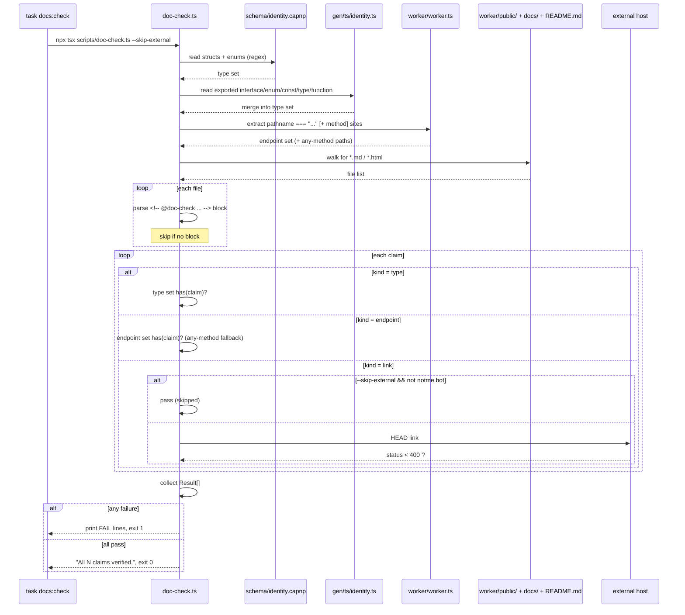

# scripts

standalone tooling — small utilities run via `npx tsx` or by Taskfile targets, not part of any deployed runtime.

## what's here

| file | purpose | invoke | exit |
|---|---|---|---|
| `doc-check.ts` | verify `@doc-check` claims in markdown/html match the codebase | `task docs:check` (or `npx tsx scripts/doc-check.ts [--skip-external] [--format json]`) | `0` all pass · `1` any claim fails or no `@doc-check` blocks found |

## how doc-check works

`doc-check.ts` enforces a contract: docs that opt in (via an HTML comment block) commit to types and endpoints that must actually exist in code. Drift fails CI.

it walks `worker/public/`, `docs/`, and the top-level `README.md` looking for blocks like:

```html
<!--
@doc-check
@types: CABundle, BridgeCertResult, CertScope
@endpoints: POST /cert, GET /authorize, GET /me
@links: https://auth.notme.bot
-->
```

then for each declared claim:

- **`@types`** — must appear as a `struct` or `enum` in `schema/identity.capnp`, **or** as an exported `interface | enum | const | type | function` in `gen/ts/identity.ts`.
- **`@endpoints`** (`METHOD /path`) — must match a `pathname === "/path" && request.method === "METHOD"` site in `worker/worker.ts`. routes without an explicit method guard match any method.
- **`@links`** — fetched via HEAD (5s timeout, follow redirects); `--skip-external` skips anything not on `notme.bot`.



## convention

scripts in this directory:

- run via `npx tsx` (typescript without a build step).
- have no runtime dependencies on the worker bundle (`worker/dist/`); they read source.
- are invoked by Taskfile targets at the repo root, not by worker request handlers.

if a script needs the worker runtime (KV, DOs, `cloudflare:workers` imports) it belongs in `worker/scripts/` instead — that directory doesn't exist yet, create it when the first such script lands.

## CI

run on every push to `main` and every pull request via `.github/workflows/ci.yml`:

```yaml
- run: task docs:check
```

it's also part of `task ship` and `task ship-prod`, so doc drift blocks deploys.

## related

- [`../README.md`](../README.md) — the file being doc-checked. the `@doc-check` block at the top declares `@types` and `@endpoints`.
- [`../Taskfile.yml`](../Taskfile.yml) — `docs:check` task definition.
- [`../schema/identity.capnp`](../schema/identity.capnp) — source of truth for `@types` (structs + enums).
- [`../gen/ts/identity.ts`](../gen/ts/identity.ts) — generated TS, also a source for `@types`.
- [`../worker/worker.ts`](../worker/worker.ts) — source of truth for `@endpoints`.
