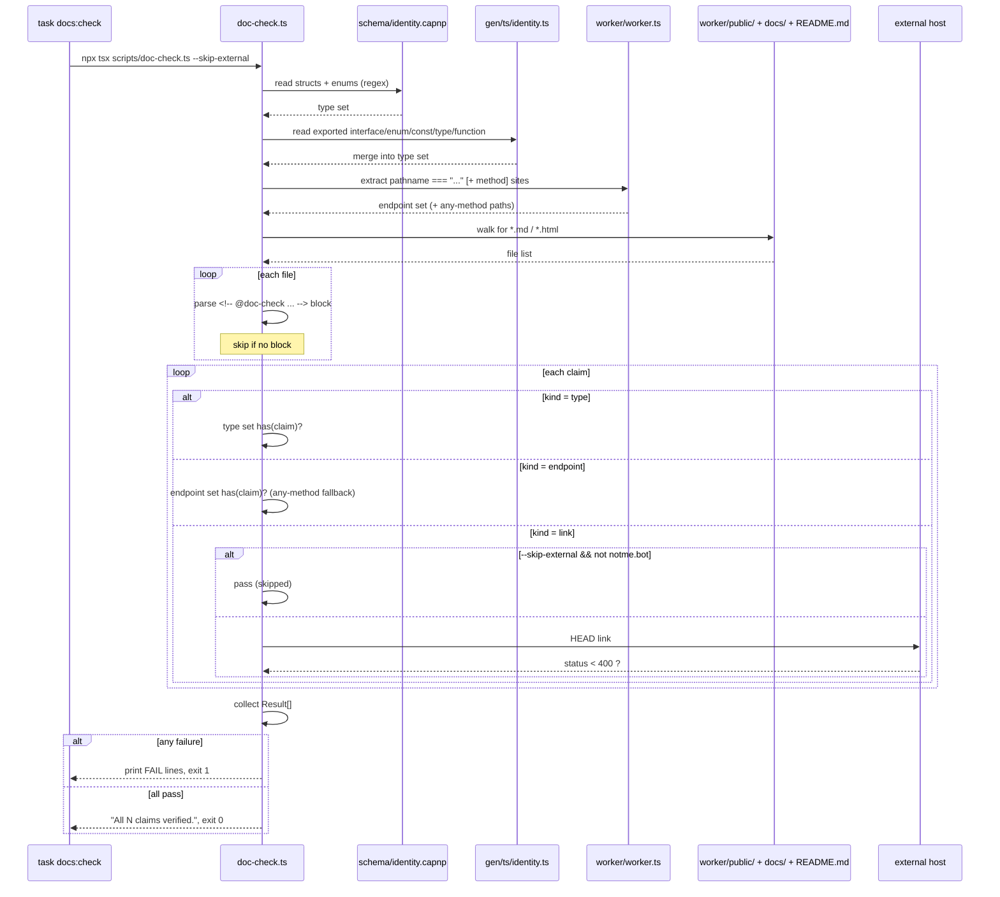

# scripts

standalone tooling — small utilities run via `npx tsx` or by Taskfile targets, not part of any deployed runtime.

## what's here

| file | purpose | invoke | exit |
|---|---|---|---|
| `doc-check.ts` | verify `@doc-check` claims in markdown/html match the codebase | `task docs:check` (or `npx tsx scripts/doc-check.ts [--skip-external] [--format json]`) | `0` all pass · `1` any claim fails or no `@doc-check` blocks found |
| `check-sha-pins.ts` | verify every external `uses:` in `.github/workflows` is pinned to a 40-char commit SHA | `task pin:check` | `0` all pinned · `1` any violation · `2` malformed workflow |
| `check-image-versions.ts` | verify `server.json` `packages[].oci` and the notme melange recipes agree with the tag the publish job will push | `task version:check VERSION=0.1.0` | `0` agree · `1` any mismatch · `2` missing/invalid VERSION or unreadable file |

## how check-image-versions works

it enforces cloister ADR-0041 §2: `packages[].version` must equal **the tag the publish job actually pushes**, because `<identifier>:<version>` has to resolve at the registry.

that is deliberately *not* "matches the git tag". notme strips the `v`, so a `v0.1.0` tag publishes `:0.1.0` — checking against the git tag would pass while the registry 404s. the script therefore takes `VERSION`, the same variable `task image:publish` tags with, and `image:publish` invokes it before pushing anything. publishing a version `server.json` doesn't declare is structurally impossible rather than merely discouraged.

two properties worth keeping when editing it:

- **both halves, every time.** presence *and* correctness are asserted separately for each field. ley-line-open v0.11.2 shipped through a guard that rejected a tagged identifier but permitted an absent version — half a rule enforced is a guard that reports success on the failure it exists to catch.
- **per entry, independently.** cloister declares `notme-identity` and `notme-proxy` as separate bundles derived separately, so "correct notme, stale notme-proxy" is reachable. every violation is collected and reported; the script does not stop at the first.

## how doc-check works

`doc-check.ts` enforces a contract: docs that opt in (via an HTML comment block) commit to types and endpoints that must actually exist in code. Drift fails CI.

it walks `worker/public/`, `docs/`, and the top-level `README.md` looking for blocks like:

```html
<!--
@doc-check
@types: CABundle, BridgeCertResult, CertScope
@endpoints: POST /cert, GET /authorize, GET /me
@links: https://auth.notme.bot
-->
```

then for each declared claim:

- **`@types`** — must appear as a `struct` or `enum` in `schema/identity.capnp`, **or** as an exported `interface | enum | const | type | function` in `gen/ts/identity.ts`.
- **`@endpoints`** (`METHOD /path`) — must match a `pathname === "/path" && request.method === "METHOD"` site in `worker/worker.ts`. routes without an explicit method guard match any method.
- **`@links`** — fetched via HEAD (5s timeout, follow redirects); `--skip-external` skips anything not on `notme.bot`.


```mermaid
sequenceDiagram
    participant Task as task docs:check
    participant DC as doc-check.ts
    participant Schema as schema/identity.capnp
    participant Gen as gen/ts/identity.ts
    participant Worker as worker/worker.ts
    participant Docs as worker/public/ + docs/ + README.md
    participant Net as external host

    Task->>DC: npx tsx scripts/doc-check.ts --skip-external

    DC->>Schema: read structs + enums (regex)
    Schema-->>DC: type set
    DC->>Gen: read exported interface/enum/const/type/function
    Gen-->>DC: merge into type set
    DC->>Worker: extract pathname === "..." [+ method] sites
    Worker-->>DC: endpoint set (+ any-method paths)

    DC->>Docs: walk for *.md / *.html
    Docs-->>DC: file list
    loop each file
        DC->>DC: parse <!-- @doc-check ... --> block
        Note over DC: skip if no block
    end

    loop each claim
        alt kind = type
            DC->>DC: type set has(claim)?
        else kind = endpoint
            DC->>DC: endpoint set has(claim)? (any-method fallback)
        else kind = link
            alt --skip-external && not notme.bot
                DC->>DC: pass (skipped)
            else
                DC->>Net: HEAD link
                Net-->>DC: status < 400 ?
            end
        end
    end

    DC->>DC: collect Result[]
    alt any failure
        DC-->>Task: print FAIL lines, exit 1
    else all pass
        DC-->>Task: "All N claims verified.", exit 0
    end
```

## convention

scripts in this directory:

- run via `npx tsx` (typescript without a build step).
- have no runtime dependencies on the worker bundle (`worker/dist/`); they read source.
- are invoked by Taskfile targets at the repo root, not by worker request handlers.

if a script needs the worker runtime (KV, DOs, `cloudflare:workers` imports) it belongs in `worker/scripts/` instead — that directory doesn't exist yet, create it when the first such script lands.

## CI

run on every push to `main` and every pull request via `.github/workflows/ci.yml`:

```yaml
- run: task docs:check
```

it's also part of `task ship` and `task ship-prod`, so doc drift blocks deploys.

## related

- [`../README.md`](../README.md) — the file being doc-checked. the `@doc-check` block at the top declares `@types` and `@endpoints`.
- [`../Taskfile.yml`](../Taskfile.yml) — `docs:check` task definition.
- [`../schema/identity.capnp`](../schema/identity.capnp) — source of truth for `@types` (structs + enums).
- [`../gen/ts/identity.ts`](../gen/ts/identity.ts) — generated TS, also a source for `@types`.
- [`../worker/worker.ts`](../worker/worker.ts) — source of truth for `@endpoints`.
