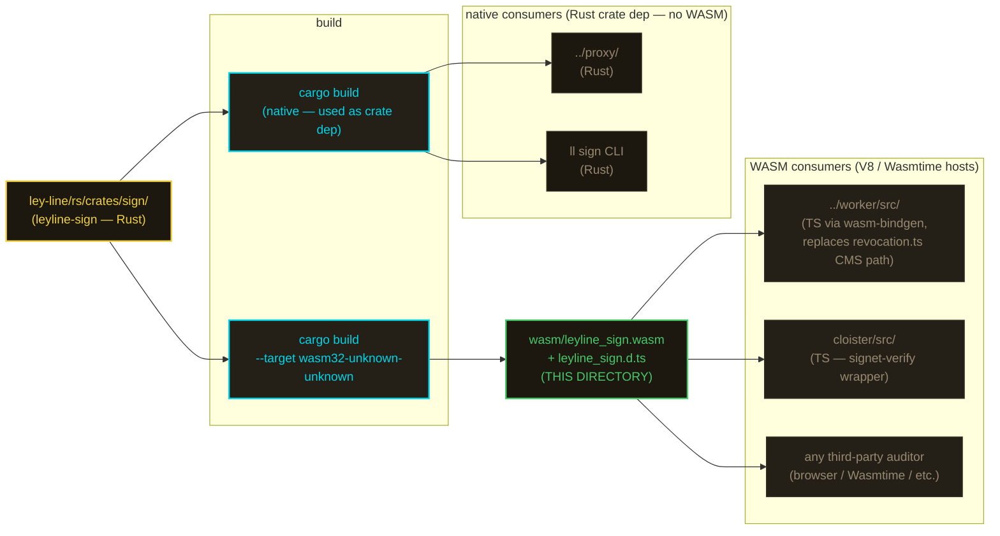

# wasm

> **currently empty by design.** the `leyline-sign` wasm32 artifact lands here once its gating chain unblocks. nothing to consume yet.

## future state

note: proxy and `ll sign` link the native Rust crate directly — they don't need the WASM build. only V8/Wasmtime-style hosts (workerd, cloister worker, browser auditors) consume the artifact in this directory.

## dependency chain

| order | bead | what | status |
|---|---|---|---|
| 1 | `ley-line-68e9e9` | leyline-cli-lib axum dep — blocks every Rust commit on workspace `cargo test` | open |
| 2 | `ley-line-e25413` | cms.rs `signingTime` fix (currently hardcoded `2025-01-01`); work staged in worktree, awaiting (1) | open |
| 3 | `ley-line-c764c6` | wasm32 emit of `leyline-sign` → `notme/wasm/`; gates on (2) | open |
| 4 | **THIS DIRECTORY POPULATED** | `leyline_sign.wasm` + `.d.ts` land here | pending |

## what lands here (future)

- **`leyline_sign.wasm`** — wasm32-unknown-unknown build of `ley-line/rs/crates/sign/`. Pure CMS / X.509 / Ed25519. No I/O, no clocks, no network.
- **`leyline_sign.d.ts`** — generated TS bindings (wasm-bindgen output) for worker-side consumers.
- **README update** — replace this file with consumption notes once the artifact ships.

## what does NOT land here

anything needing WASI clocks, files, or network. pure crypto only. if a future revision wants `signingTime` back in CMS SignedAttributes, the WASM contract is per-target (`js_sys::Date` in V8, `wasi:clocks/wall-clock` elsewhere) behind cargo features — not bolted onto this artifact.

## why

per cloister ADR-0007 ("single shared crypto artifact"), `leyline-sign` is the one source of truth for CMS / X.509 / Ed25519 across the constellation. one Rust crate, one audit surface — consumed as WASM by the TypeScript edge (notme worker, cloister worker, browser auditors) and as a native Rust crate by the local plane (proxy, `ll sign` CLI). same crypto bytes everywhere; identity-portable across V8, Wasmtime, and native Rust. without this, the TS side reimplements CMS in TypeScript and the audit surface doubles.

## related

- [`cloister/docs/adr/0007-interlace-substrate.md`](../../cloister/docs/adr/0007-interlace-substrate.md) — "single shared crypto artifact" rationale; this directory is the worked example.
- `ley-line-c764c6` — wasm32 emit bead.
- `ley-line-e25413` — `signingTime` fix; gates the wasm emit (frozen 2025-01-01 would silently break temporal binding).
- `ley-line-68e9e9` — axum-dep blocker on the whole ley-line Rust commit chain.
- [`../worker/src/revocation.ts`](../worker/src/revocation.ts) — current TS verifier surface that the WASM module will replace / augment.
