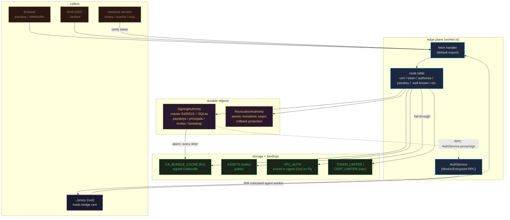
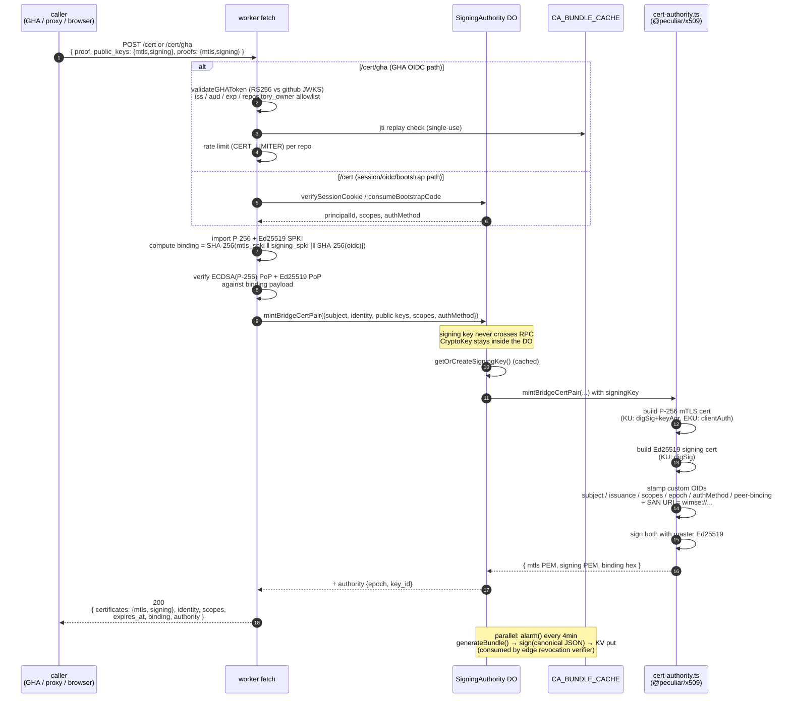

# worker

cloudflare worker — the **edge plane** of notme's two-plane identity model. same code runs at cloudflare prod (`auth.notme.bot`) and locally via workerd. the heaviest subdir in this repo: 2k-line entrypoint, two durable objects, ~20 endpoints, dual runtime.

## what this is

the signet identity authority deployed as a CF worker. issues short-lived bridge certs (P-256 mTLS + Ed25519 signing pair via 008 PoP exchange), mints DPoP-bound access tokens (RFC 9449), verifies passkeys, exchanges GHA OIDC, serves `.well-known/*` discovery + JWKS + CA bundle. the master Ed25519 key is born inside a CF durable object and never leaves — no `wrangler secret put`, no PEM on anyone's machine.

paired with **`../proxy/`** (rust local plane). edge mints, local proxy holds the private key in process memory and presents the cert on outgoing requests.

## runtime topology



local workerd (`config.capnp` + `examples/config-colocated.capnp`) runs the same worker.ts. `worker.ts` detects local mode via `SITE_URL=http://localhost*` and disables the CF cache API. KV is unavailable locally; the `CA_BUNDLE_CACHE` binding is omitted and `revocation.ts` fails open. DO storage uses workerd's local SQLite on disk, `NOTME_KEY_STORAGE=ephemeral` so the private key never lands on disk (verified by `test-local.sh` strings-grep on the sqlite file).

## cert exchange flow (the core protocol)



`expires_at` is `now + 5min` by default (`GHA_CERT_TTL_MS`). private keys for the cert pair live only in the caller — proxy keeps them in process memory; GHA hands them to the action and the action keeps them for the workflow run.

## endpoints

served on `auth.notme.bot` (and `localhost:8788` locally). main domain `notme.bot/*` falls through to ASSETS.

| method | path | handler | auth |
|---|---|---|---|
| `POST` | `/cert` | `cert-exchange.ts` `handleCertExchange` | proof in body (session cookie / bootstrap; oidc returns 501) |
| `POST` | `/cert/gha` | worker.ts `handleCertGHA` | GHA OIDC bearer + jti replay + repo-owner allowlist |
| `POST` | `/token` | worker.ts inline | session cookie + DPoP proof header |
| `POST` | `/authorize/token` | worker.ts inline | session cookie (unbound redirect token, no DPoP) |
| `GET` | `/authorize` | worker.ts `authorizePageHtml` | session cookie (302 → `/login` if missing); validates `redirect_uri` via `auth/redirect-uri.ts` |
| `GET` | `/me` | worker.ts inline | session cookie; HTML or JSON via `Accept` |
| `POST` | `/auth/passkey/register/options` | `handlePasskey` → DO `passkeyRegistrationOptions` | open (first user needs bootstrap code) |
| `POST` | `/auth/passkey/register/verify` | `handlePasskey` → DO `passkeyVerifyRegistration` | depends on first-user / bootstrap |
| `POST` | `/auth/passkey/login/options` | `handlePasskey` → DO | open |
| `POST` | `/auth/passkey/login/verify` | `handlePasskey` → DO | open |
| `POST` | `/auth/passkey/reset` | worker.ts inline | bootstrap code (single-use) |
| `GET` | `/auth/passkey/status` | worker.ts inline | session w/ `authorityManage` |
| `POST` | `/auth/oidc/login` | worker.ts inline | OIDC token (`verifyOIDC`, audience pinned to `notme.bot`) |
| `GET` | `/connections` | worker.ts inline | session cookie |
| `POST` | `/connections` | worker.ts inline; verifies via `auth/verify-proof.ts` | session cookie + proof (oidc/x509) |
| `POST` | `/invites` | worker.ts inline; uses `auth/principals.canGrant` | session w/ `authorityManage` |
| `GET` | `/join` | worker.ts inline (renders login asset) | open |
| `POST` | `/join` | worker.ts inline | invite token in body |
| `GET` | `/.well-known/jwks.json` | worker.ts inline → DO `getPublicKeyJwk` | open, edge-cached |
| `GET` | `/.well-known/signet-authority.json` | worker.ts inline | open, edge-cached |
| `GET` | `/.well-known/ca-bundle.pem` | worker.ts inline → DO `getCACertificatePem` | open, edge-cached |
| `GET` | `/.well-known/security.txt` | worker.ts inline | open |
| `GET` | `/api/docs` | worker.ts → `ASSETS.fetch(/_api-docs)` | open |
| `GET` | `/login` | worker.ts → `ASSETS.fetch(/_login)` | open |
| `GET` | `/provenance/dispatch/v1` | worker.ts inline | open; HTML or JSON-Schema by `Accept` |
| `GET` | `/provenance/handoff/v1` | worker.ts inline | open; HTML or JSON-Schema by `Accept` |
| `GET` | `/robots.txt`, `/sitemap.xml`, `/favicon.ico` | worker.ts inline | open |

worker.ts also exposes a private RPC surface via the `AuthService` `WorkerEntrypoint` — service-binding-only, no HTTP. methods: `mintBridgeCert`, `mintDPoPToken`, `getPublicKeyPem`, `getCACertificatePem`, `getAuthorityState`, `verifySession`, plus the 009 identity-gated triple `authenticate` / `proxy` / `sign` / `identity`. consumed by colocated agent workers (see `examples/agent-worker.js`).

note: discovery (`/.well-known/signet-authority.json`) and the JSON landing page were trimmed in this PR (commit `4a51a6d`) to advertise only routes that are actually wired — `/exchange-token` and `/api/cert/register` are no longer claimed. If those endpoints are eventually wired, re-add them to discovery alongside the implementation. Re-drift would be caught by `notme-803923`-class tests if a future iteration adds a "discovery vs route table" CI assertion (separate bead).

## bindings

| binding | type | purpose | declared |
|---|---|---|---|
| `SIGNING_AUTHORITY` | DO namespace | master Ed25519 key + passkeys + principals + invites + bootstrap (SQLite) | wrangler.toml + config.capnp |
| `REVOCATION` | DO namespace | atomic monotonic seqno (rollback gate on CABundle) | wrangler.toml + config.capnp |
| `CA_BUNDLE_CACHE` | KV namespace | signed `CABundle` written by the SA alarm, read by edge revocation verifier | wrangler.toml only (KV not in workerd) |
| `VPC_AUTH` | vpc_service | private tunnel to signet (Go) on Fly — fall-through for unrouted auth paths | wrangler.toml only |
| `ASSETS` | static assets | `public/` directory; `run_worker_first = true` | wrangler.toml |
| `TOKEN_LIMITER` | rate limiter | per-principal `/token` (20/min) | wrangler.toml.example only |
| `CERT_LIMITER` | rate limiter | per-repo `/cert/gha` (10/min) | wrangler.toml.example only |
| `PASSKEY_LIMITER` | rate limiter | per-IP passkey routes (5/min) — wired in `handlePasskey` | wrangler.toml.example |
| `SITE_URL` | var | canonical site origin | both |
| `SIGNET_AUTHORITY_URL` | var | authority origin for self-references | both |
| `GHA_ALLOWED_OWNERS` | var | CSV of GitHub orgs/users allowed to mint via `/cert/gha` | both |
| `GHA_CERT_AUDIENCE` | var (optional) | expected `aud` on incoming GHA OIDC; default `notme.bot` | optional |
| `GHA_CERT_TTL_MS` | var (optional) | cert lifetime; default 5min | optional |
| `JTI_MIN_TTL_SECONDS` | var (optional) | min jti replay window; default 60 | optional |
| `RATE_LIMIT_*` | var (optional) | KV-limiter knobs (legacy path; CF rate limiter is preferred) | optional |
| `ALLOWED_AUDIENCES` | var (optional) | CSV override of token-mint audience allowlist (`allowed-audiences.ts`) | optional |
| `NOTME_KEY_STORAGE` | var | `ephemeral` / `cf-managed` / `encrypted` (last is unimplemented, fails fast) | config.capnp sets `ephemeral` |

## modules

`worker.ts` (root, 2k lines) — fetch handler + `AuthService` RPC entrypoint + APAS predicate schemas + inline route bodies. exports `SigningAuthority` and `RevocationAuthority` for the DO migrations.

| file | role | key exports |
|---|---|---|
| `src/cert-authority.ts` | X.509 cert minting (WebCrypto + `@peculiar/x509`) — sets KU/EKU/SAN/custom-OID extensions | `mintGHABridgeCert`, `mintBridgeCertPair`, `importPublicKey`, `BridgeCertResult`, `BridgeCertPairResult` |
| `src/cert-exchange.ts` | `/cert` proof → cert-pair-or-token. discriminated-union proof type (session / oidc / bootstrap) | `handleCertExchange`, `CertExchangeRequest`, `CertPairExchangeResponse`, `TokenExchangeResponse` |
| `src/signing-authority.ts` | `SigningAuthority` DO. owns master Ed25519, mints all certs/tokens, stores passkeys + principals + invites + bootstrap, runs the bundle-refresh alarm. Alarm loop hardened against runaway-bill failure modes (notme-5c2511): `getAlarm()`-guarded re-arm, 5-strike circuit breaker, `alarm_health` table + `getAlarmHealth()` RPC for runaway detection (driftRatio metric). | `SigningAuthority` (class), `getAlarmHealth()`, `resetAlarmHealth()` |
| `src/revocation.ts` | `RevocationAuthority` DO + edge revocation verifier (`checkRevocation`) | `RevocationAuthority`, `CABundle`, `checkRevocation`, `verifyBundleSignature`, `bundleCanonical`, `isBundleStale`, `BUNDLE_MAX_AGE_MS` |
| `src/gha-oidc.ts` | github actions OIDC JWT validation (RS256, JWKS-cached 1h) | `validateGHAToken`, `GHAClaims`, `GHAClaimsSchema` |
| `src/platform.ts` | runtime abstraction: `KVCache` / `SQLiteCache` / `MemoryCache`, `detectKeyStorage`, `ED25519` constant | `createPlatform`, `Platform`, `MemoryCache`, `SQLiteCache`, `KVCache`, `ED25519`, `KeyStorageMode` |
| `src/key-id.ts` | RFC-7638-style truncated SHA-256 over SPKI for stable kid (16 hex / 64 bits) | `keyIdFromSpki` |
| `src/allowed-audiences.ts` | token-mint audience allowlist (env override) | `getAllowedAudiences`, `DEFAULT_ALLOWED_AUDIENCES` |
| `src/auth/dpop.ts` | DPoP proof JWT validation (RFC 9449): typ/alg/jwk/sig/jti/htm/htu/iat/nonce/ath | `validateDpopProof` |
| `src/auth/dpop-handler.ts` | composable token-minting orchestration with injected JTI store (testable without DOs) | `handleToken`, `buildJwksResponse` |
| `src/auth/token.ts` | EdDSA `at+jwt` mint + verify; `cnf.jkt` when DPoP-bound, omitted for redirect tokens | `mintAccessToken`, `verifyAccessToken` |
| `src/auth/session.ts` | HMAC-SHA256 session cookie (no server store); v1→v2 migration on read | `createSessionCookie`, `verifySessionCookie`, `clearSessionCookie` |
| `src/auth/passkey.ts` | WebAuthn register + auth via `@simplewebauthn/server`; SQLite schema + challenge sweep | `registrationOptions`, `verifyRegistration`, `authenticationOptions`, `verifyAuthentication`, `ensurePasskeySchema` |
| `src/auth/principals.ts` | principal model (UUID stable across credential rotation), capability grants, federated identities, invites | `createPrincipal`, `grantCapability`, `getCapabilities`, `canGrant`, `linkFederatedIdentity`, `findPrincipalByFederated`, `createInvite`, `redeemInvite` |
| `src/auth/connections.ts` | OIDC/x509 identity connections joined to a passkey credential | `createConnection`, `getConnections`, `findByProvider` |
| `src/auth/verify-proof.ts` | OIDC + X.509 proof verification with mandatory audience pin (`TRUSTED_ISSUERS` allowlist) | `verifyOIDC`, `verifyX509`, `verifyProof`, `Proof`, `VerifiedIdentity` |
| `src/auth/redirect-uri.ts` | `/authorize` redirect_uri matrix: required → parsable → https-or-localhost → exact-host allowlist | `validateRedirectUri`, `ALLOWED_REDIRECT_HOSTS` |
| `src/auth/timing-safe.ts` | constant-time string compare (HMAC-then-XOR) for bootstrap codes etc. | `timingSafeEqual` |

## tests

```bash
cd worker
npm ci
npx vitest run                              # unit: src/__tests__/*.test.ts + ../gen/ts/__tests__ + ../vault/src/__tests__
npx vitest run src/__tests__/adversarial.test.ts   # focused: adversarial corpus
npm run build:local                         # esbuild bundle worker.ts → dist/worker.js
bash test-local.sh                          # workerd smoke: discovery / jwks / ca-bundle + invariant #1 (no private key on disk)
bash test-e2e.sh                            # playwright contract tests (extracts bootstrap code from workerd stdout)
npx playwright test e2e/contract.spec.ts    # contract tests directly (workerd must be running)
```

invariant #1 (`test-local.sh`): `find DO sqlite | strings | grep '"d"'` must return nothing. ephemeral mode never persists the private JWK.

## deploy

**cloudflare prod** — `auth.notme.bot`:

```bash
cp wrangler.toml.example wrangler.toml
# edit wrangler.toml: set KV namespace id, vpc service id, GHA_ALLOWED_OWNERS
wrangler deploy
# or: task worker:deploy / task worker:rollback / task worker:verify
```

bindings to provision in CF first: KV namespace (`wrangler kv namespace create CA_BUNDLE_CACHE`), VPC service (`wrangler vpc create`), DO migrations apply on deploy. master key generates on first request — no `wrangler secret put`.

**local workerd** — `localhost:8788`, no CF account:

```bash
npm run build:local
npx workerd serve config.capnp --experimental
```

bootstrap code prints to stdout on first `/auth/passkey/register/options`. enter at `localhost:8788/login` to register the admin passkey.

**local workerd colocated (009)** — notme + air-gapped agent worker:

```bash
npm run build:local
npx workerd serve examples/config-colocated.capnp --experimental
# notme on :8788, agent on :3000
# agent has NO globalOutbound — only the NOTME service binding to AuthService
```

**container** — see `../packages/` (melange + apko, ~40MB OCI, signed).

## threat model

see [`THREAT_MODEL.md`](THREAT_MODEL.md) — adversarial scenarios, trust boundaries, mitigations.

## related

- **`../proxy/`** — local plane (rust). holds the bridge cert pair in process memory; presents on outgoing requests. paired with the cert pair this worker mints.
- **`../action/`** — github action wrapping `POST /cert/gha`. zero stored secrets — the OIDC JWT is the credential.
- **`../schema/identity.capnp`** — wire types: `CABundle`, `BridgeCertPair`, `GHAClaims`, etc. **`../gen/ts/`** is generated from this; `gen/ts/dpop.ts` is the shared `base64urlDecode` / `validateClaims` / `computeJwkThumbprint` SDK consumed here. open audit: hand-rolled TS encoding does not yet match real cap'n proto wire format — bead `notme-803923`.
- **`../docs/design/`** — ADRs 005 (multi-user identity), 006 (DPoP tokens), 007 (secretless local proxy), 008 (bridge-cert CSR + WIMSE), 009 (identity-gated runtime).
- **`../wasm/`** — empty slot for `leyline-sign` wasm32 (gated on `ley-line-c764c6`); will land here when the rust signer is FFI-ready.
- **signet** (Go, separate repo) — sister identity authority. issues bundles; this worker is the verifier side via `revocation.ts`.
